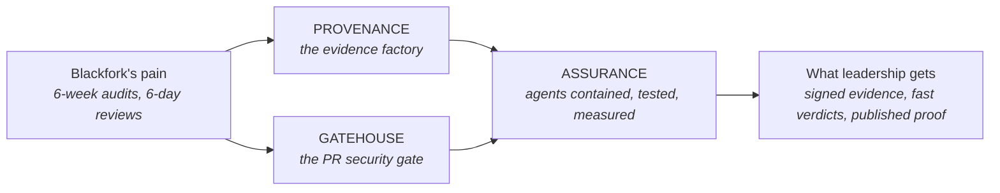

# START HERE — The Two-Minute Tour

> **In one line:** This repo takes one project from business problem → requirements →
> architecture → working code: an AI-agent security platform for a fictional company,
> built so the agents themselves can be shown safe and measured, not just useful.

**You are here:** START HERE
**Audience:** 🟢 anyone · **Reads in:** ~2 min

## The 30-second version

Blackfork Systems, a fictional 180-person software company selling to defense
contractors, is drowning in compliance work. Audit preparation eats its three-person
security team for six weeks of hand-collected screenshots, and security review of code
changes takes six days. This repo designs and builds their fix: two systems that put AI
agents to work, plus the proof that those agents can be trusted.

**Provenance** turns raw security data into audit evidence automatically, with every
claim citing its source and a human signing off. **Gatehouse** checks every code change
in minutes instead of days, using exact rules where rules work and an AI judge where
judgment is required. Both run inside one **assurance** layer: every agent reaches data
through a single guarded door, is threat-modeled like any other attack surface, is
attacked on purpose with deliberate injection attempts, and is scored and profiled
before it is trusted. Everything, including the agents' rules of engagement and the
tests that attack them, is code in this repo.

## The picture



## How it works

1. **The pain** is written up with real numbers as a business case with nine measurable
   requirements (BR-1…BR-9). Seven say what the automation must do; two say what it must
   prove about itself. Everything downstream traces back to one of them.
2. **Provenance** ingests security data (network alerts, cloud logs, vulnerability
   scans, infrastructure state) into a governed data store, where AI agents collect
   evidence, map it to compliance controls, score risk, and draft the audit packet.
3. **Gatehouse** gates this very repo's pull requests: deterministic checks block
   rule-breaking changes instantly; an AI judge reviews design quality, and earns the
   right to block only once its accuracy is measured.
4. **Assurance** is what both systems run under. One guarded door for all data access,
   with identity, policy, and an audit record on every call. Guardrails on every agent's
   input and output. A threat model of the agents themselves, with a test per threat.
   Deliberate attacks seeded into the evaluation sets, with results published. Every
   agent traced and profiled for tokens, tool calls, and latency.
5. **The outputs** are the three things Blackfork's leadership asked for: audit evidence
   that holds up, security review that doesn't slow shipping, and a written, tested
   answer to "why should we believe the robot?"

## If we're screensharing right now

Read in this order; every page ends with a link to the next one.

- **Have 5 minutes?** This page, then `01-business-case.md` §2–3 (the pains and the
  nine requirements).
- **Have 15 minutes?** Add the three architecture pictures in reading order:
  `02-architecture/context.md`, `02-architecture/provenance-flow.md`,
  `02-architecture/gatehouse-pr-flow.md`.
- **Going deep?** `02-architecture/architecture-narrative.md` for the why of every
  stage, then `ROADMAP.md` for how it gets built and proven, then `40-adrs/` for the
  decision trail. The agent-runtime threat model and the measured results land in
  `02-architecture/agent-threat-model.md` and `analysis/` as the roadmap reaches them.

## The numbers this is accountable to

| Pain today | Target (requirement) |
|---|---|
| 6 weeks of manual audit-evidence collection | ≤1 week, continuous, with chain of custody (BR-2) |
| 6-day security review queue | ≤30-minute verdicts on standard changes (BR-3) |
| No diagrams/threat models for services | 100% coverage, enforced at merge (BR-4) |
| ~3,800 unranked vulnerability findings | Ranked by real exploitability (BR-6) |
| "Trust us" automation | Every agent action logged and auditable (BR-7) |
| AI nobody can vouch for | Every threat to the agents has a mitigation and a test; containment demonstrated (BR-8) |
| Demo-grade AI | Evaluations gate every release; cost and behavior profiled and published (BR-9) |

## Design principles (the whole architecture in eight lines)

1. Evidence over assertion. 2. One door for data. 3. Deterministic before probabilistic.
4. Narrow agents, visible seams. 5. The automation must survive audit. 6. Humans sign.
7. Rent the commodity, build the differentiator. 8. Attack it yourself; measure before
trusting.

## Why it's built this way

Docs-first, because the thing being demonstrated is judgment, not just code — and
judgment lives in requirements, diagrams, and decision records. The company is fictional
so every number and constraint can be shown publicly and traced honestly (no NDA-shaped
holes), and every artifact cites a BR because traceability from business need to merged
change is the product. The assurance layer gets equal billing with the two systems
because an AI platform that cannot show its own safety and measured behavior has not
finished the job (BR-8, BR-9).

## Go deeper

**Next:** `01-business-case.md` — the fictional company, its pains, and the nine
requirements everything cites.

```
docs/
  DOCS-STANDARD.md          how to read everything here
  01-business-case.md       the fictional company, pains, requirements
  02-architecture/          diagrams, architecture narrative, agent-runtime threat model
  10-foundation/            what both systems stand on (IaC, CI/CD, taxonomy)
  20-provenance/            the evidence factory, one doc per plane
  30-gatehouse/             the PR gate, one doc per lane
  40-adrs/                  numbered decisions with their reasoning
  analysis/                 measured results: eval scores, workload profiles
  ROADMAP.md                the phased build plan
```
