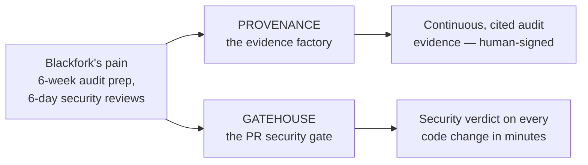

# START HERE — The Two-Minute Tour

> **In one line:** This repo shows one project taken from business problem → requirements
> → architecture → working code: an AI-agent security platform built for a fictional
> company, on an NVIDIA-native stack.

**You are here:** START HERE
**Audience:** 🟢 anyone · **Reads in:** ~2 min

## The 30-second version

Blackfork Systems (a fictional 180-person defense-adjacent software company) is drowning
in compliance work: audit preparation eats its three-person security team for six weeks
of manual evidence collection, and security review of code changes takes six days. This
repo designs and builds their fix — two systems. **Provenance** turns raw security data
into audit evidence automatically, with every claim citing its source and a human signing
off. **Gatehouse** checks every code change in minutes instead of days, using exact rules
where rules work and an AI judge where judgment is required. Everything — infrastructure,
policies, pipelines, even the AI agents' rules of engagement — is code in this repo.

## The picture



## How it works

1. **The pain** is written up with real numbers as a business case with seven measurable
   requirements (BR-1…BR-7). Everything downstream traces back to one of them.
2. **Provenance** ingests security data (network alerts, cloud logs, vulnerability
   scans, infrastructure state) into a governed data store, where AI agents collect
   evidence, map it to compliance controls, score risk, and draft the audit packet.
3. **Gatehouse** gates this very repo's pull requests: deterministic checks block
   rule-breaking changes instantly; a measured AI judge reviews design quality.
4. **The outputs** are the two things Blackfork's leadership asked for: audit evidence
   that holds up, and security review that doesn't slow shipping.

## If we're screensharing right now

- **Have 5 minutes?** Read this page, then `01-business-case.md` §2–3 (the pain and the
  requirements).
- **Have 15 minutes?** Add the two system overviews: `20-provenance/README.md` and
  `30-gatehouse/README.md`.
- **Going deep?** Pick any plane or lane doc (they all follow the same template — see
  `DOCS-STANDARD.md`), or start at `40-adrs/ADR-001` for the decision record trail.

## The numbers this is accountable to

| Pain today | Target (requirement) |
|---|---|
| 6 weeks of manual audit-evidence collection | ≤1 week, continuous, with chain of custody (BR-2) |
| 6-day security review queue | ≤30-minute verdicts on standard changes (BR-3) |
| No diagrams/threat models for services | 100% coverage, enforced at merge (BR-4) |
| ~3,800 unranked vulnerability findings | Ranked by real exploitability (BR-6) |
| "Trust us" automation | Every agent action logged and auditable (BR-7) |

## Design principles (the whole architecture in seven lines)

1. Evidence over assertion. 2. One door for data. 3. Deterministic before probabilistic.
4. Narrow agents, visible seams. 5. The automation must survive audit. 6. Humans sign.
7. Rent the commodity, build the differentiator.

## Why it's built this way

Docs-first, because the thing being demonstrated is judgment, not just code — and
judgment lives in requirements, diagrams, and decision records. The company is fictional
so every number and constraint can be shown publicly and traced honestly (no NDA-shaped
holes), and every artifact cites a BR because traceability from business need to merged
change is the product.

## Go deeper

```
docs/
  DOCS-STANDARD.md          how to read everything here
  01-business-case.md       the fictional company, pains, requirements
  02-architecture/          diagrams + architecture narrative
  10-foundation/            what both systems stand on (IaC, CI/CD, taxonomy)
  20-provenance/            the evidence factory, one doc per plane
  30-gatehouse/             the PR gate, one doc per lane
  40-adrs/                  numbered decisions with their reasoning
```
