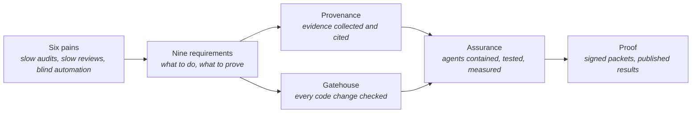

# Blackfork Systems — Business Case & Requirements

> **In one line:** A fictional company's real-shaped problems, turned into nine measurable requirements that every diagram, decision, and pull request in this repo must cite.

**You are here:** START HERE › Business Case
**Audience:** 🟢 anyone · **Reads in:** ~8 min

> **Fictional company.** Blackfork Systems is an invented customer used to drive this
> portfolio the way real architecture work is driven: business problem first, technology
> last. Any resemblance to real companies is coincidental.

## The 30-second version

Blackfork is a 180-person software company selling to defense contractors. Its
three-person security team is buried: six weeks of every audit cycle goes to collecting
screenshots by hand, and code changes wait six days for a security review. The obvious
fix is to let AI agents do the collecting and the reviewing. But that creates a second
problem: an auditor will not accept evidence from a robot nobody can vouch for, and an
agent that reads outside text and can reach sensitive data is itself something an
attacker can aim at. So the requirements come in two halves. The first half says what
the automation must do: continuous evidence, fast reviews, ranked vulnerabilities. The
second half says what the automation must prove about itself: that it is contained,
tested against deliberate attacks, and measured before it is trusted.

## The picture



## 1. Company snapshot

| | |
|---|---|
| **Company** | Blackfork Systems (fictional), Kansas City, MO — ~180 employees, Series C |
| **Product** | *Windrow*, a SaaS platform for mission logistics & fleet telemetry |
| **Customers** | Two DoD prime contractors (CUI flows down by contract) + commercial utility operators |
| **Engineering** | ~60 engineers on 9 teams; ~40 container services on GKE |
| **Security team** | 3 people: AppSec lead, GRC analyst, cloud security engineer |
| **Compliance drivers** | SOC 2 Type II now (commercial procurement); CMMC Level 2 / NIST SP 800-171 assessment in ~12 months (DoD flow-down) |

## 2. The pain, measured

- **P1 — Evidence drag.** Last SOC 2 window: **6 weeks**, ~450 artifacts hand-collected
  (screenshots, CSV exports). The GRC analyst spent ~60% of the quarter on audit prep
  instead of risk work.
- **P2 — Review bottleneck.** PRs touching auth or CUI paths wait a **median 6 business
  days** for security review. Two releases slipped last quarter; teams have started
  quietly merging around the queue.
- **P3 — Stale system of record.** The SSP is a Word doc last touched 14 months ago. An
  auditor asked for the telemetry-ingest threat model — none existed.
- **P4 — Vulnerability noise.** ~3,800 open container findings, exploitability unknown;
  triage is ad-hoc spreadsheet work.
- **P5 — Point-in-time evidence.** Screenshots age instantly. Both the auditor and the
  prime are signaling expectations of *continuous* evidence.
- **P6 — Automation nobody can vouch for.** A pilot that let a chat assistant summarize
  scanner output was pulled after one week: nobody could say what it had read, what it
  could reach, or whether a crafted log line could steer it. The auditor's first question
  about any AI-produced evidence — *"why should I believe the robot?"* — has no answer
  today, and an assistant that reads attacker-influenced text and can call tools is a
  new attack surface the team has no way to test.

## 3. Business requirements

The first seven say what the automation must **do**. The last two say what it must
**prove about itself**. Both halves carry equal weight: an agent that does the job but
cannot be shown safe fails BR-1 just as surely as one that does nothing.

| ID | Requirement | Target / metric | Driver |
|---|---|---|---|
| **BR-1** | Unblock ~$4.2M stalled pipeline: pass SOC 2 Type II next cycle; CMMC L2 assessment-ready in 12 months | Attestation + readiness dates met | Revenue |
| **BR-2** | Cut audit-evidence effort with automated, continuously collected evidence carrying chain of custody | ≥80% reduction (6 wks → ≤1 wk) | Cost |
| **BR-3** | Security feedback on every PR, humans only on flagged high-risk changes | ≤30 min for standard changes, SLA ≥95% | Velocity |
| **BR-4** | Every production service has a current architecture diagram + threat model, enforced at merge | 100% coverage | Quality |
| **BR-5** | Collect evidence once, map to many frameworks (SOC 2 + 800-171) | 1 evidence base → 2 frameworks | Scalability |
| **BR-6** | Rank vulnerability work by true exploitability, not raw CVE count | ≥90% triage-noise reduction | Risk |
| **BR-7** | Every automated decision is explainable, logged, and reversible — the automation itself must survive audit | 100% of agent actions in audit log | Trust |
| **BR-8** | **Agent safety.** The agents are treated as an attack surface: every trust boundary is threat-modeled, every threat maps to a mitigation and a test, and containment against prompt injection and tool abuse is demonstrated, not asserted | 100% of threats have a mitigation + test; 0 successful data exfiltration or unauthorized tool calls in the seeded adversarial set; results published | Safety |
| **BR-9** | **Evaluation rigor.** No agent or judge is trusted on the strength of a demo: each is scored against golden and adversarial question sets before every release, and its cost, latency, and long-run behavior are profiled and published | Release blocked on eval regression; precision published per judge rubric item; workload profile published with charts | Confidence |

## 4. Constraints

- **C1** — No security headcount coming; three people must scale through automation.
- **C2** — CUI cannot leave the accreditation boundary → a self-hostable inference path
  (NIM containers) is required; hosted endpoints are acceptable only for non-CUI dev work.
- **C3** — Auditors and assessors require human-readable trails and human sign-off on
  every packet. Agents draft; people approve.
- **C4** — Cloud budget is flat; prefer open, commodity components.

## 5. Solution shape

Two systems do the work. A third layer, shared by both, proves the work can be trusted.

- **Provenance** — an evidence lakehouse plus GRC agents. Ingests security telemetry,
  stores it in governed tables, and runs agents that collect evidence, map it to
  controls, score risk, and draft audit packets. Answers **BR-1, BR-2, BR-5, BR-6, BR-7**.
- **Gatehouse** — a merge gate for GitHub. A deterministic lane blocks PRs missing
  required docs or violating codified security requirements; an LLM judge reviews design
  quality against rubrics, and earns the right to block only once its accuracy is
  measured. Answers **BR-3, BR-4, BR-7**.
- **Assurance** — the safety and evaluation machinery both systems run under. One
  governed door for all data access, with identity, policy, and audit on every call.
  Guardrails on every agent's input and output. A threat model of the agent runtime
  itself, with a test per threat. Deliberate injection and tool-abuse attempts seeded
  into the eval sets, with results published. Every agent traced and profiled. Answers
  **BR-7, BR-8, BR-9** — and it is the part of the platform that makes the other two
  believable.

## 6. Requirements traceability

| BR | Capability | Component(s) | Proven by |
|---|---|---|---|
| BR-2 | Continuous evidence pipeline | Dagster assets → Iceberg Gold `evidence` views | Evidence-freshness dashboard |
| BR-3 | Two-lane PR gate | Gatehouse deterministic checks + LLM judge | Public PR history + latency metric |
| BR-4 | Docs-as-code enforcement | Presence checks, PR template, CODEOWNERS | Coverage report per service |
| BR-5 | Multi-framework mapping | controls-mcp (OSCAL catalogs) + Control Mapper agent | One evidence row cited by two frameworks |
| BR-6 | Exploitability triage | NVIDIA vulnerability-analysis blueprint output as an ingest source | Ranked findings table |
| BR-7 | Agent governance | MCP auth gateway, OPA decisions, audit table | Immutable audit log; every call traceable to identity + policy decision |
| BR-8 | Agent safety | Agent-runtime threat model, parameterized tools, NeMo Guardrails, seeded injection evals, Garak red-team runs | Threat table with a passing test per row; published containment results |
| BR-9 | Evaluation rigor | Golden + adversarial eval sets per agent, planted-flaw judge evals, OpenTelemetry + workload profiling | Eval scores gating release; precision per rubric item; workload profile with charts |
| BR-1 | All of the above | End-to-end platform | Generated audit packet, human-signed |

## 7. Component glossary & learning path

Read top to bottom — the order mirrors how data moves through the system, and it's the
suggested order for learning each tool. The last layer is the one the safety and
evaluation requirements (BR-8, BR-9) live in.

### Layer 1 — Sources
| Component | Plain English | Learn it by |
|---|---|---|
| Security Onion | A network-sensor VM (Zeek + Suricata) that generates realistic security alerts | Boot the eval-mode ISO in a VM, watch alerts land |
| Trivy / Grype | Scanners that find known CVEs in container images and list what's inside them (SBOM) | Scan one public image, read the JSON output |
| GCP audit logs | The cloud's record of who did what | Export one day of logs, find your own actions |
| Terraform state | Source of truth for what infrastructure is actually deployed | Parse a state file, list the resources |
| NVIDIA vulnerability-analysis blueprint | An agent workflow that judges whether a CVE is truly exploitable in a given container | Run its notebook against one CVE |

### Layer 2 — Pipelines
| Component | Plain English | Learn it by |
|---|---|---|
| Dagster | The scheduler that runs data jobs, tracks lineage, and retries failures | Dagster Essentials tutorial (free) |
| Presidio | Finds and strips personal data (PII) before storage | Run the analyzer on a fake log line |
| Asset checks | Data-quality tests that fail loudly instead of letting bad data flow | Add one check to a Dagster asset |

### Layer 3 — Lakehouse
| Component | Plain English | Learn it by |
|---|---|---|
| Apache Iceberg | An open table format: database-grade tables on plain object storage, with time travel | Create one table, query it "as of" yesterday |
| DuckDB | A zero-server SQL engine, perfect for querying Iceberg locally | Load a CSV, join it to an Iceberg table |
| Medallion (bronze/silver/gold) | A naming convention: raw → cleaned → ready-to-serve | Sketch the three stages for one data source |

### Layer 4 — MCP access layer
| Component | Plain English | Learn it by |
|---|---|---|
| MCP | An open protocol so agents can call tools/data in a structured, discoverable way | Build the official quickstart server, list its tools |
| NeMo Agent Toolkit (`nvidia-nat`) | NVIDIA's open-source library for building and serving agent workflows | Run the simple-calculator example, then `nat mcp serve` it |
| OPA / Rego | Rules-as-code: a policy engine that answers "is this call allowed?" | Rego Playground; write a rule denying `min_length < 15` |
| OSCAL | NIST's machine-readable format for control catalogs and SSPs | Open a NIST OSCAL catalog JSON, find one control |

### Layer 5 — Agents
| Component | Plain English | Learn it by |
|---|---|---|
| NIM endpoints | NVIDIA-hosted LLMs (free dev tier) — the reasoning engine agents call | `curl` one chat completion against the API |
| NeMo Retriever + Milvus | Embedding/reranking models plus a vector database for semantic search | Embed 10 docs, run one similarity query |
| A2A protocol | A standard for agents to call *other agents* across a network boundary, with auth | Run NAT's A2A example with two processes |

### Layer 6 — Assurance (safety and evaluation)
| Component | Plain English | Learn it by |
|---|---|---|
| NeMo Guardrails | Filters and constrains what goes into and out of an LLM — the first line against prompt injection | Add one input rail to a hello-world config |
| Agent-runtime threat model (STRIDE, pytm) | A written list of how the agents themselves could be attacked, each with a mitigation and a test | Model one agent + one tool, read the generated threats |
| Eval harness (golden + adversarial sets) | Fixed question sets that score an agent after every change — including questions designed to make it misbehave | Write five golden questions and two hostile ones for one agent |
| Garak | NVIDIA's open-source LLM vulnerability scanner — red-teams your own agents | Run one probe set against a hosted model |
| OpenTelemetry + NAT profiling | Standard tracing and per-run accounting: every agent step becomes an inspectable span with tokens and latency | View one NAT run's trace in Phoenix or Jaeger |
| Prometheus + Grafana | Metrics collection and dashboards | Graph one pipeline metric |
| Conftest / Semgrep | Run Rego policies / code patterns as CI checks | Fail a CI job with one rule on a YAML file |
| GitHub required status checks | The mechanism that lets a bot actually block a merge | Make one Action required on a test repo |

## 8. How this repo tells the story

```
docs/
  00-START-HERE.md           ← the two-minute tour
  01-business-case.md        ← this file (the "why")
  02-architecture/           ← diagrams, narrative, and the agent-runtime threat model (the "what")
  10-foundation/             ← IaC, CI/CD, taxonomy
  20-provenance/  30-gatehouse/
  40-adrs/                   ← numbered decisions, each citing BR IDs (the "how")
  analysis/                  ← measured results: eval scores, workload profiles (the "proof of proof")
  ROADMAP.md                 ← the phased build plan
src/                         ← the build (the proof)
```

Every ADR and every PR description cites the requirement it serves ("Implements BR-3"),
so the git history itself demonstrates working backwards from business need to running
code. The safety and evaluation requirements get the same treatment: a threat without a
test, or an agent without a published score, is a gap the docs are required to show
rather than hide.

## Why it's built this way

The requirements are split into "do" and "prove" on purpose. P1 through P5 are the pains
any compliance-automation pitch would list, and BR-1 through BR-7 answer them. P6 is
the pain that appears the moment the answer is "use AI agents": the agents read text an
attacker can influence, they can reach sensitive data through tools, and the people who
must accept their output cannot see inside them. BR-8 and BR-9 exist so that this second
problem is a requirement with a metric, not a caveat in a slide. That is also why the
company is fictional: every number, constraint, and failure can be shown publicly and
traced honestly, with no NDA-shaped holes (see `00-START-HERE.md`).

## Go deeper

**Next:** `02-architecture/context.md` — who is involved and where the two systems sit.

- `02-architecture/architecture-narrative.md` — the what and why of every stage
- `ROADMAP.md` — the phased plan, each phase citing the requirements above
- `40-adrs/README.md` — the decisions, each citing a BR
