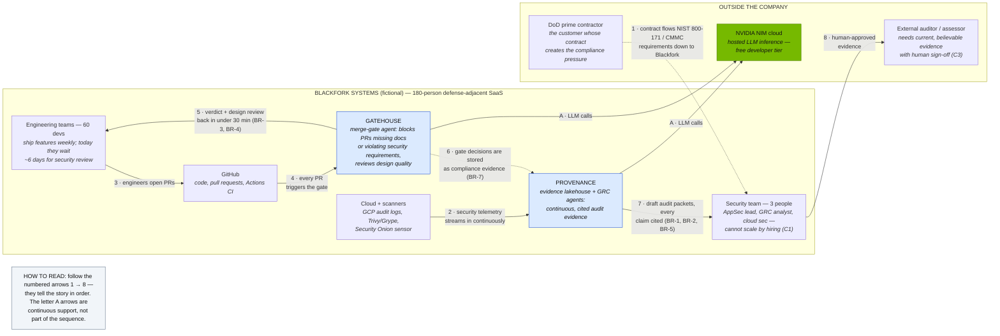

# Context Diagram

> **In one line:** Who's involved and where Provenance and Gatehouse sit — the story is on the numbered arrows, 1 to 8.

**You are here:** START HERE › Architecture › Context Diagram
**Audience:** 🟡 engineer · **Reads in:** ~2 min

> **v1 diagram** — scheduled for a linear-readability rework (see roadmap). The
> step-numbering system is described in the diagram's own legend.

