# End State — The Blackfork Ecosystem

> **In one line:** Every person, feed, service, agent, and safeguard in the finished platform on one map, each with the job it does for the whole.

**You are here:** START HERE › Architecture › End State
**Audience:** 🟡 engineer · **Reads in:** ~5 min

## The 30-second version

The other architecture pages each tell one story with a few boxes and arrows. This page
is the opposite on purpose: it is the complete inventory of the finished platform, with
no arrows. Every piece appears once, grouped by the layer it belongs to, and the line
under each name says what that piece does for the system. Use it to answer "is this
part of the platform, and what is it for?" in one glance. For how the pieces connect,
go to the flow pages; they draw the paths a few boxes at a time.

## The picture

This is the one diagram in the repo exempt from the seven-node rule (docs standard,
rule 7), because it is an inventory, not a flow. Read it top to bottom by layer. Inside
a layer, boxes are peers.

```mermaid
flowchart TB

subgraph PEOPLE["People and outside parties"]
  direction LR
  ENG["Engineering teams<br><i>ship the code the gate reviews</i>"]
  SEC["Security team<br><i>set policy, sign every packet</i>"]
  PRIME["Defense prime contractor<br><i>flows compliance rules down by contract</i>"]
  AUDITOR["External auditor<br><i>accepts signed, cited evidence</i>"]
  FIN["Finance<br><i>budgets from measured AI usage</i>"]
end

subgraph SOURCES["Sources — the raw security facts"]
  direction LR
  SO["Security Onion sensor<br><i>network alerts that become evidence</i>"]
  GCPLOG["Cloud audit logs<br><i>record of who did what</i>"]
  SCAN["Container scanners<br><i>known vulnerabilities per image</i>"]
  TFSTATE["Terraform state<br><i>truth of what is deployed</i>"]
  VEX["Exploitability verdicts<br><i>which vulnerabilities actually matter here</i>"]
  GATEEVID["Gatehouse decisions<br><i>the merge gate reports itself as evidence</i>"]
  CODINGAGENTS["Coding-agent sessions<br><i>the AI usage the company already has</i>"]
end

subgraph DATA["Data plane — facts become agent-ready tables"]
  direction LR
  DAGSTER["Dagster<br><i>runs every feed on schedule, keeps lineage</i>"]
  BRONZE["Bronze tables<br><i>the untouched original of every record</i>"]
  PRESIDIO["Presidio<br><i>removes personal data before it is kept</i>"]
  SILVER["Silver tables<br><i>cleaned, typed, redacted</i>"]
  CHECKS["Quality checks<br><i>stop bad data before agents see it</i>"]
  GOLD["Gold views<br><i>small tables shaped for agents, one system per row</i>"]
  DUCK["DuckDB<br><i>answers queries without a database server</i>"]
  STEWARD["Pipeline Steward agent<br><i>repairs a broken feed by opening a pull request</i>"]
end

subgraph CONTEXT["Context plane — the one door to data"]
  direction LR
  EMCP["evidence-mcp<br><i>fixed evidence queries, nothing free-form</i>"]
  CMCP["controls-mcp<br><i>the compliance rulebooks, machine-readable</i>"]
  GW["Auth gateway<br><i>checks who, checks policy, records, then forwards</i>"]
  OPA["Policy engine<br><i>decides every call from written rules</i>"]
  AUDIT["Audit log<br><i>every call and its decision, denials included</i>"]
end

subgraph AGENTS["Agent plane — the analysts"]
  direction LR
  COLLECT["Evidence Collector<br><i>gathers the proof each control is met</i>"]
  MAPPER["Control Mapper<br><i>ties each proof to the rules it satisfies</i>"]
  RISK["Risk Analyst<br><i>turns findings into ranked, explained verdicts</i>"]
  WRITER["Report Writer<br><i>drafts the audit packet, every claim cited</i>"]
  JUDGE["Gatehouse judge<br><i>scores design quality on every code change</i>"]
  NIM["Model endpoints<br><i>the reasoning every agent rents</i>"]
  RETRIEVER["Semantic search<br><i>finds related policy and prior evidence</i>"]
end

subgraph ASSURE["Assurance plane — contained, tested, measured"]
  direction LR
  RAILS["Guardrails<br><i>filter what goes into and out of every agent</i>"]
  SANDBOX["Sandbox<br><i>walls in any agent that runs commands</i>"]
  GARAK["Red-team scanner<br><i>attacks our own agents on a schedule</i>"]
  SAFETY["Output safety scorer<br><i>grades what the agents say</i>"]
  EVALS["Eval harness<br><i>fair and hostile questions, scored every change</i>"]
  PLANTED["Planted-flaw set<br><i>measures how often the judge is right</i>"]
  OTEL["Tracing<br><i>every agent step, token, and call, inspectable</i>"]
  GRAFANA["Dashboards<br><i>posture, pipeline health, agent cost</i>"]
  THREAT["Threat model<br><i>every attack path with its control and test</i>"]
  PROFILE["Workload profiles<br><i>what every agent costs and how it behaves</i>"]
end

subgraph GATEHOUSE["Gatehouse — the merge gate"]
  direction LR
  DOCSCHECK["Docs-standard check<br><i>blocks changes whose docs fall short</i>"]
  PRESENCE["Presence checks<br><i>code cannot change without its diagram and threat model</i>"]
  CONFTEST["Policy-as-code checks<br><i>blocks configuration that breaks a written rule</i>"]
  SEMGREP["Code-pattern checks<br><i>blocks known-bad code shapes</i>"]
  PROMOTE["Promotion machinery<br><i>lets the judge block only after measured precision</i>"]
  PROTECT["Branch protection<br><i>makes the gate's verdict binding, for everyone</i>"]
end

subgraph CLOUD["Cloud substrate — runs it all at near-zero idle"]
  direction LR
  RUN["Cloud Run<br><i>hosts every service, scales to zero</i>"]
  PUBSUB["Pub/Sub<br><i>carries events between planes</i>"]
  GCS["Object storage<br><i>holds the data tables</i>"]
  AR["Artifact Registry<br><i>holds the container images</i>"]
  SM["Secret Manager<br><i>holds keys so the repo never does</i>"]
  WIF["Keyless CI identity<br><i>lets automation deploy without stored credentials</i>"]
  TF["Terraform modules<br><i>define every plane as code</i>"]
  GHA["GitHub Actions<br><i>plan on pull request, apply on main</i>"]
  CC["Confidential computing<br><i>keeps controlled data inside an attested boundary</i>"]
end

subgraph OUT["What leaves the platform"]
  direction LR
  PACKET["Audit packet<br><i>the evidence, every claim traceable to a record</i>"]
  SIGN["Human sign-off<br><i>a person approves before anything ships</i>"]
  VERDICT["Merge verdict<br><i>block with the rule named, or merge</i>"]
  RESULTS["Published results<br><i>eval scores, judge precision, workload profiles</i>"]
end
```

## How it works

Read the layers top to bottom. Each is one row on the map.

1. **People and outside parties.** Who creates the pressure and who receives the
   output: engineers shipping code, the security team that sets policy and signs, the
   prime contractor whose contract pushes compliance rules down, the auditor who
   accepts the evidence, and finance, which budgets from measured AI usage.
2. **Sources.** Every raw feed: the network sensor, cloud logs, container scanners,
   infrastructure state, exploitability verdicts, the gate's own decisions, and the
   coding-agent sessions engineers already run.
3. **Data plane.** Dagster moves every feed through three tables: the untouched
   original, the cleaned and redacted copy, and small agent-ready views. Quality
   checks stop bad data. The Pipeline Steward repairs broken feeds by opening pull
   requests rather than pushing fixes.
4. **Context plane.** The one door. Two servers expose fixed queries and the
   rulebooks; the gateway checks identity and policy and records every call; the
   policy engine decides; the audit log remembers.
5. **Agent plane.** Four analysts that gather, map, rank, and write, plus the judge
   that reviews code. All rent their reasoning from model endpoints and share one
   semantic search.
6. **Assurance plane.** Everything that keeps the agents contained, tested, and
   measured: filters on their input and output, a sandbox for any that run commands,
   scheduled attacks, output-safety grading, the eval sets, tracing, dashboards, the
   threat model, and the workload profiles.
7. **Gatehouse.** The exact checks that block, the machinery that decides when the
   judge may block, and the branch protection that makes a verdict binding.
8. **Cloud substrate.** The services, storage, secrets, and keyless identity that run
   the platform, all defined as code, all scaling to zero when idle.
9. **What leaves the platform.** Signed audit packets, merge verdicts, and published
   results.

## The details

**Why no arrows.** Every connection on this map is drawn properly, at most seven boxes
at a time, on the flow pages: the context diagram, the Provenance flow, the Gatehouse
flow, and the threat model. Drawing them here would turn an inventory into a tangle.
If a box on this map is not on any flow page, that is a documentation bug.

**Where each row is explained.** People and sources: the context diagram. Data,
context, and agent planes: the Provenance flow. Gatehouse: the Gatehouse flow. The
assurance plane: the threat model and the narrative's "what could go wrong" section.
The cloud substrate: the foundation docs.

**What is not on the map.** Documents and decisions, such as the business case, the
decision records, and the roadmap, are not components. The docs-standard check appears
because it runs as a gate.

**Keeping it current.** When a component is added to the design, its box is added here
and to the flow page that connects it, in the same pull request. When one is cut, the
box is removed. Build progress is not tracked here; the roadmap does that.

## Why it's built this way

Flow diagrams answer "how does this work" and deliberately hide everything not on the
path. A reviewer looking for a specific piece, a sandbox, a safety scanner, a secrets
store, should not have to read six pages to learn whether the design includes it. One
inventory with a one-line job per box answers that in a glance, and the discipline of
writing that one line for every component is a check on the design itself: a box whose
job cannot be stated in a few words is a box that should not be there (BR-4). The
seven-node rule stays in force everywhere else; this page is the single, named
exception.

## Go deeper

**Next:** `architecture-narrative.md` — the what and why of every stage.

- `context.md`, `provenance-flow.md`, `gatehouse-pr-flow.md` — the flows that connect
  these boxes
- `agent-threat-model.md` — the assurance plane, boundary by boundary
- `../ROADMAP.md` — the order in which the platform gets built
