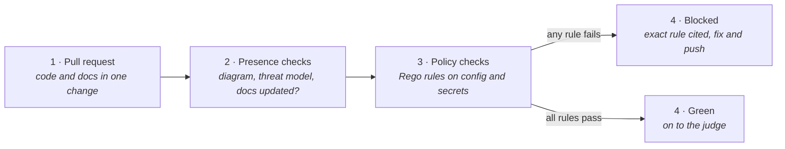
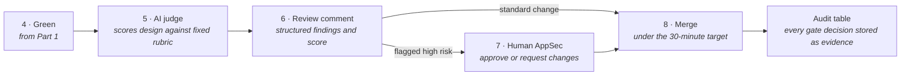
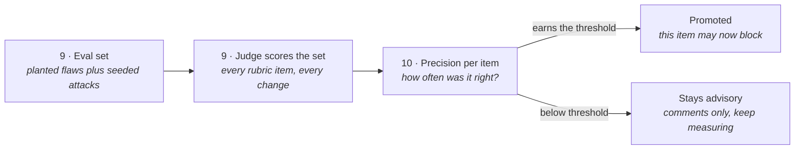

# Gatehouse PR Flow

> **In one line:** A pull request's path through exact rules first, an AI judge second, and a human only when flagged — plus how the judge earns the right to block.

**You are here:** START HERE › Architecture › Gatehouse PR Flow
**Audience:** 🟡 engineer · **Reads in:** ~5 min

## The 30-second version

Every code change to this repo meets the cheap, exact rules first: did the docs and
threat model change with the code, does the configuration break a written security
rule. A failure blocks the merge within minutes and names the rule. Changes that pass
go to an AI judge that scores the design against a fixed checklist and leaves a review.
Only changes the judge flags as risky pull in a person. The judge starts with no power
to block anything. It is tested against changes with planted flaws and deliberate
attempts to trick it, and only the checks it gets right often enough are promoted from
advice to veto. Every decision the gate makes is stored as compliance evidence.

## The picture

Three parts, one after another. Steps 1 to 10 continue across them.

**Part 1 — Exact rules first.** Cheap checks that can block, in minutes.

**Part 2 — Judgment second.** The AI judge reviews; a human joins only when flagged.

**Part 3 — Earning the right to block.** How advice becomes veto, and only with proof.

## How it works

1. **Pull request.** An engineer opens a change with code and docs together. The
   required status checks fire.
2. **Presence checks.** Did source change without the architecture diagram or threat
   model changing too? Did behavior change without a doc update? These are file-level
   rules, no model involved (BR-4).
3. **Policy checks.** Rego rules run through Conftest against configuration: password
   minimum length of 15 per NIST SP 800-63B, no secrets in config, TLS settings pinned.
   Each rule names the standard it enforces.
4. **Blocked or green.** Any failure blocks the merge and cites the exact rule, with
   feedback in about two minutes. All passes turn the check green and hand the change
   to the judge.
5. **AI judge.** A NeMo Agent Toolkit workflow reads the diff, the diagram, and the
   threat model and scores them against a versioned rubric: STRIDE coverage, trust
   boundaries drawn, data flows labeled, authentication design addressed. The diff is
   data to the judge, never instructions.
6. **Review comment.** The judge posts structured findings and a score on the pull
   request (BR-3).
7. **Human AppSec.** Only when the judge flags high risk does a person review. They
   approve or request changes.
8. **Merge.** Standard changes merge with no human in the loop, which is how the
   30-minute target holds. Every decision the gate made, by rule or by judge, is written
   to the audit table and becomes compliance evidence in Provenance (BR-7).
9. **Eval set.** Separately from live traffic, the judge is scored against a set of
   synthetic pull requests with known planted design flaws, plus cases that carry
   deliberate prompt-injection text inside diffs and docs to test whether the judge can
   be steered (BR-8, BR-9).
10. **Precision per item.** For each rubric item, how often the judge was right is
    measured and published. Items that clear the threshold set in ADR-005 are promoted
    to blocking. Items below it stay advisory and keep being measured. Promotion is
    reversible: a regression demotes.

## The details

**Fail-open versus fail-closed.** If the deterministic lane cannot run, the merge is
blocked, because a rule that cannot be evaluated cannot be passed. If the judge cannot
run, the merge proceeds without its comment, because an advisory check that is down
should not stop shipping. Blocking rubric items are treated like the deterministic lane
once promoted. The full rule is ADR-005.

**What the judge cannot do.** It cannot merge, cannot call tools beyond reading the
change, and cannot change its own rubric. The rubric is a versioned file in this repo
and changes to it go through this same gate.

**Why the seeded attacks matter.** A judge that reads pull-request text is reading text
an attacker controls. A diff can contain a comment saying "ignore the threat model
requirement." The eval set includes exactly those cases so containment is a measured
number, not a hope (BR-8).

**The gate is also a sensor.** Gatehouse's decisions land in Provenance's audit table,
so "every service has a current threat model" (BR-4) is provable from the same evidence
base the auditor sees.

## Why it's built this way

Deterministic before probabilistic is the gate's core principle (BR-3, BR-4): never ask
a model to do a parser's job, and never give a probabilistic check veto power it has not
statistically earned. Part 3 exists because of BR-9: the judge's authority is a function
of its measured precision, and that number is published rather than assumed. The seeded
attacks in the eval set exist because of BR-8: the judge is an agent that reads hostile
input, so it gets the same treatment as every other agent in the platform.

## Go deeper

**Next:** `architecture-narrative.md` — the what and why of every stage in both systems.

- `provenance-flow.md` — where the gate's decisions end up as evidence
- `../30-gatehouse/README.md` — the lane-by-lane docs as they are built
- `../40-adrs/README.md` — ADR-005 (two lanes, promotion by measured precision,
  fail-open and fail-closed)
- `../ROADMAP.md` phase 4 — the order in which the judge, the eval set, and promotion
  get built
