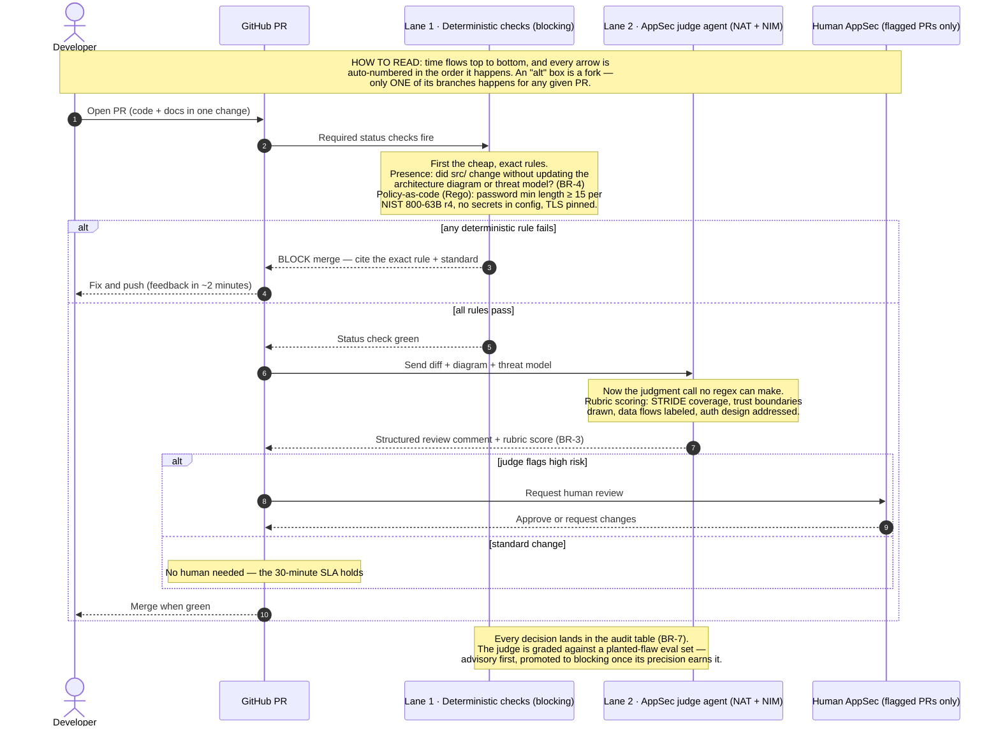

# Gatehouse PR Flow

> **In one line:** A pull request's path through the deterministic lane, the LLM judge, and (only when flagged) a human.

**You are here:** START HERE › Architecture › Gatehouse PR Flow
**Audience:** 🟡 engineer · **Reads in:** ~2 min

> **v1 diagram** — scheduled for a linear-readability rework (see roadmap). The
> step-numbering system is described in the diagram's own legend.

## The 30-second version

A pull request meets exact rules first — missing threat model or a codified requirement violation blocks the merge in minutes with the rule cited — then an LLM judge scores design quality against a versioned rubric, and only flagged changes pull in a human. Time flows top to bottom; every arrow is numbered.

## The picture

## Why it's built this way

Deterministic-before-probabilistic is the gate's core principle (BR-3, BR-4): never ask a model to do a parser's job, and give the judge blocking power only after its precision is measured. This sequence shows exactly where each kind of check sits.
