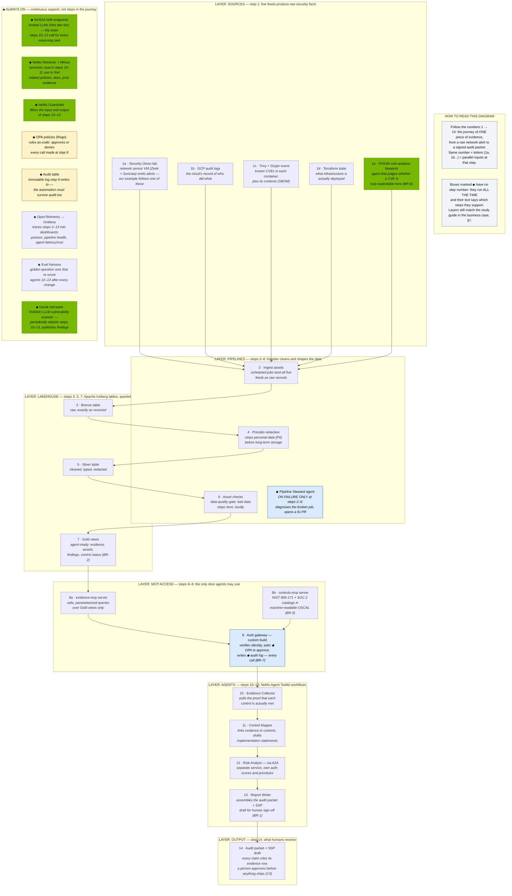

# Provenance Flow

> **In one line:** One piece of evidence's 14-step journey from raw alert to signed audit packet.

**You are here:** START HERE › Architecture › Provenance Flow
**Audience:** 🟡 engineer · **Reads in:** ~2 min

> **v1 diagram** — scheduled for a linear-readability rework (see roadmap). The
> step-numbering system is described in the diagram's own legend.

