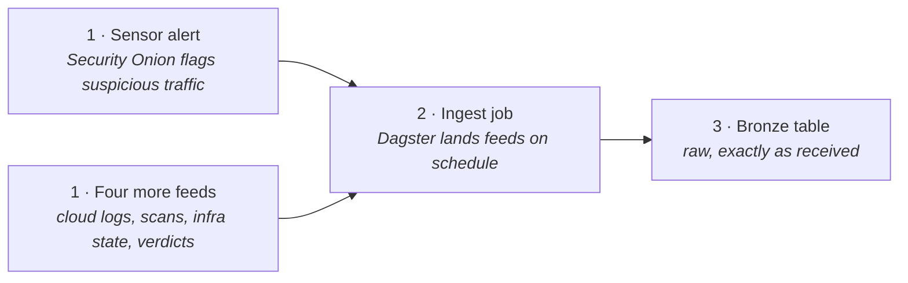
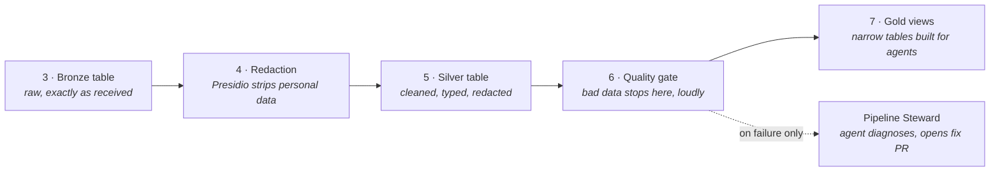
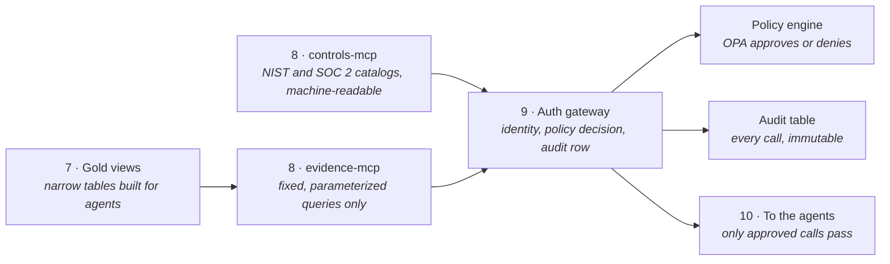
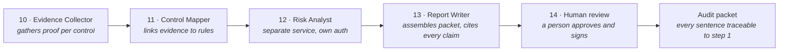

# Provenance Flow

> **In one line:** One network alert's 14-step journey from raw detection to a signed audit packet.

**You are here:** START HERE › Architecture › Provenance Flow
**Audience:** 🟡 engineer · **Reads in:** ~5 min

## The 30-second version

A sensor on the network notices something suspicious. That alert is collected and stored
untouched, then cleaned, checked, and shaped into a small set of tables built for AI
agents to read. The agents can reach those tables through exactly one door, and every
knock on that door is identity-checked, policy-checked, and written down. Four narrow
agents then do what a compliance analyst does by hand today: gather the proof, match it
to the rules, rank the risk, and write the draft. A person reads the draft and signs.
Every sentence in what they sign can be traced back to the original alert.

## The picture

Four parts, one after another. Steps 1 to 14 continue across them and are the same
numbers the architecture narrative uses.

**Part 1 — Collect.** Raw security facts land, untouched.

**Part 2 — Clean and shape.** Personal data comes out, bad data stops, good data becomes agent-ready.

**Part 3 — Guard the door.** Agents reach data one way, and every call is checked and logged.

**Part 4 — Draft and sign.** Four narrow agents draft; a human signs.

## How it works

1. **Sensor alert.** A Security Onion sensor (Zeek and Suricata) flags suspicious
   traffic. Four other feeds arrive alongside it: cloud audit logs, container scan
   results, deployed-infrastructure state, and exploitability verdicts from NVIDIA's
   vulnerability-analysis blueprint.
2. **Ingest job.** Dagster runs scheduled jobs that land all five feeds and record where
   every row came from.
3. **Bronze table.** The raw record is stored exactly as received, so any later claim
   can be replayed against the original.
4. **Redaction.** Presidio strips personal data before anything is kept long-term.
5. **Silver table.** The cleaned, typed, redacted version.
6. **Quality gate.** Asset checks test the data and fail loudly. On failure only, the
   Pipeline Steward agent diagnoses the broken job and opens a fix pull request; it never
   pushes a fix itself.
7. **Gold views.** Small, documented tables built for agents: evidence, assets,
   findings, control status. Every row carries the system it describes.
8. **Two MCP servers.** MCP is the Model Context Protocol, the open standard for letting
   an agent call tools. The evidence server exposes fixed, parameterized queries over
   Gold views only; the controls server serves the NIST SP 800-171 and SOC 2 rulebooks in
   machine-readable form. There is no other way for an agent to reach data.
9. **Auth gateway.** Every call from every agent passes through it. The gateway verifies
   who is calling, asks the policy engine whether this caller may make this call, and
   writes the call to the audit table. Denied calls stop here.
10. **Evidence Collector.** The first agent gathers the proof that each control is met.
11. **Control Mapper.** Links each piece of evidence to the controls it satisfies and
    drafts the implementation statements.
12. **Risk Analyst.** Runs as a separate service with its own authentication, reached
    over the agent-to-agent (A2A) protocol, and scores and prioritizes findings. With the exploitability
    verdicts from step 1 it forms the investigation workflow: raw finding in, ranked
    and explained verdict out.
13. **Report Writer.** Assembles the audit packet and system security plan draft. Every
    claim carries a citation to its evidence row.
14. **Human review.** A person reads, corrects, and signs. Nothing leaves without a
    signature, and the signed packet can be walked back sentence by sentence to step 1.

## The details

**What wraps every agent, all the time.** These are not steps; they are the conditions
under which steps 10 to 13 are allowed to run.

| Component | Role in the flow |
|---|---|
| NVIDIA NIM endpoints | The hosted models the agents call for every reasoning task; the same models ship as self-hosted containers for the controlled-unclassified-information (CUI) path (architecture decision record ADR-008) |
| NeMo Guardrails | Filters each agent's input and output; the first line against prompt injection carried in log lines and documents (BR-8) |
| NeMo Retriever + Milvus | Semantic search steps 10 and 11 use to find related policies, prior evidence, and control language |
| OpenTelemetry | Every agent step becomes a span with tokens, tool calls, and latency, feeding the workload profile (BR-9) |
| Eval harness | Golden and adversarial question sets that re-score each agent after every change; a regression blocks release (BR-9) |
| Garak | NVIDIA's large-language-model (LLM) vulnerability scanner, run against our own agents on a schedule, findings published (BR-8) |
| NeMo Auditor | Scores agent outputs against safety categories; published alongside the Garak findings so attack results and output safety are read together (BR-8) |
| Sandbox | The Pipeline Steward runs commands, so it runs in a locked container with no host filesystem, no ambient credentials, and an egress allow-list (OpenShell where available) (BR-8) |

**What the gateway checks.** Identity comes from the caller's service credential. The
policy decision comes from OPA, evaluating Rego rules that say which identity may call
which tool with which arguments. The audit row records caller, tool, arguments, decision,
and timestamp. The three happen on every call, including denied ones.

**Why the Risk Analyst is separate.** It crosses a real network and authentication
boundary so the platform proves agents can cooperate across trust boundaries, and so a
compromised agent cannot reach another agent's tools (BR-8, ADR-004).

## Why it's built this way

The platform's whole argument is chain of custody, and a numbered single journey is the
clearest way to show it: any claim in the packet can be walked backward along these same
steps to an untouched original record (BR-2, BR-7). The door in Part 3 is the reason the
agents in Part 4 can be trusted with governed data: one path, identity-checked,
policy-checked, and logged, makes containment something the audit table can prove
rather than something the design asserts (BR-7, BR-8). Full rationale per stage:
`architecture-narrative.md`.

## Go deeper

**Next:** `gatehouse-pr-flow.md` — the same philosophy pointed at this repo's own pull
requests.

- `architecture-narrative.md` — what and why for each of the six stages above
- `../01-business-case.md` §7 — plain-English glossary of every component named here
- `../40-adrs/README.md` — ADR-001 (gateway), ADR-003 (MCP-only), ADR-004 (narrow
  agents), ADR-006 (redaction before storage)
