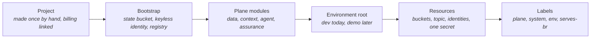

# Cloud Substrate — The GCP Footprint, Entirely in Code

> **In one line:** One project made by hand, then everything inside it defined by
> Terraform modules that mirror the platform's planes and reached by automation
> through keyless identity.

**You are here:** START HERE › Foundation › Cloud Substrate
**Audience:** 🔴 deep dive · **Reads in:** ~7 min

## The 30-second version

The platform runs on Google Cloud, and exactly one thing there is done by hand: creating
the project and linking it to billing, because the code that describes everything else
needs a place to keep its own records first. From then on, nobody configures the cloud
by clicking. A bootstrap run from an engineer's laptop creates the storage for
Terraform's records, an identity that GitHub's automation can prove it holds without any
stored password, and a registry for container images. After that, the automation itself
plans and applies every bucket, queue, identity, and permission. Every resource carries
labels saying which layer it belongs to, which environment it lives in, and which
business requirement justifies it. While nobody is using it, the whole footprint costs
cents.

## The picture



## How it works

1. **Project.** Created once with the cloud command line, billing linked, the handful of
   service APIs enabled. Its id never appears in the repository; it lives in ignored
   variable files locally and in a repository variable for automation.
2. **Bootstrap.** A small Terraform root run once from an engineer's machine. It creates
   the versioned bucket that holds Terraform's records, the identity pool that trusts
   tokens from this one GitHub repository, two deployer identities (one that can only
   read and plan, one that can apply and only from the main branch), and the image
   registry. Its own records stay on that machine; they hold only names.
3. **Plane modules.** One Terraform module per plane, so the repository tree, the
   architecture pages, and the cloud console slice the same way. Each declares its
   inputs, its labels, and only resources that cost nothing while idle.
4. **Environment root.** The `dev` root composes the modules and keeps its records in
   the bootstrap bucket. Automation plans it on every pull request and applies it after
   merge. A `demo` root will be the same modules with a different variable file.
5. **Resources.** A lakehouse bucket, a platform-events topic and its subscription,
   one identity per service and agent, two secrets whose values are added from a
   shell and never through code, and two Cloud Run services at scale to zero: the
   evidence server, which admits only the gateway's identity, and the gateway with the
   policy engine as a sidecar, open on the network because it enforces its own
   tokens. The apply job builds both images from the merged commit and records the
   deployed tag beside the state, so a pull-request plan compares against what runs.
6. **Labels.** Every resource carries `plane`, `system`, `env`, and `serves-br`, so a
   bill, a dashboard, or a search can be cut by layer, environment, or requirement.

## The details

**Layout.**

```
infra/
  bootstrap/           run once per project; local records; creates the delivery plane
  modules/
    delivery-plane/    state bucket, identity pool and provider, deployers, registry
    data-plane/        lakehouse bucket, platform-events topic
    context-plane/     gateway and evidence-server identities, the model-key secret
    agent-plane/       agent identities and what each may read
    assurance-plane/   event reader identity and its subscription
  envs/
    dev/               the root automation plans and applies; records in the state bucket
```

Anything that names a real project (`*.tfvars`, `backend.hcl`) is ignored by git; an
`.example` twin beside each shows the shape.

**Keyless identity, spelled out.** GitHub gives each Actions job a signed token naming
the repository and the git reference it runs on. The identity pool's provider accepts a
token only if its repository claim equals this repository; any other token is rejected
before an identity is even considered. Two bindings then decide what an accepted token
may become. A token from any branch of the repository may become the plan identity,
which holds read-only project access plus write access to the records bucket for locks.
Only a token whose repository and reference together equal this repository on
`refs/heads/main` may become the apply identity. A fork or a feature branch cannot
apply, not by policy that could drift but by the shape of the trust itself. No key file
exists to rotate, leak, or commit.

**What each identity may do.**

| Identity | Reach | Why |
|---|---|---|
| Plan deployer | Read the project and its permission bindings; read and lock the records | A pull request must show its effect and change nothing |
| Apply deployer | Manage Cloud Run, identities and their bindings, registry, secrets, topics, buckets | An environment root creates all of these; narrowed as the planes settle |
| Gateway | Publish to the platform-events topic; read its signing key; invoke the evidence server | Audit rows leave as events; tokens are checked against the key; the gateway is the only caller the evidence door admits |
| Evidence server | Read the lakehouse bucket | Fixed queries over the gold table it loads from the bucket at start, read only (ADR-002, ADR-003); the baked fixture is its fallback |
| Controls server | The evidence server's identity: read the lakehouse bucket | Fixed queries over the gold controls table; the baked catalog is its fallback; admits only the gateway |
| Evidence Collector (the agent service) | Read the model-key and signing-key secrets | Runs every agent job; verifies callers and mints job tokens with the signing key; its data path is the gateway |
| Assurance reader | Read the platform-events subscription | Gate decisions and pipeline results become evidence |

**Label schema.**

| Key | Values | Question it answers |
|---|---|---|
| `plane` | data / context / agent / assurance / delivery | Which layer of the platform is this? |
| `system` | `platform`, or a registered business system | Whose data or scope does it serve? |
| `env` | dev / demo | Which copy is this? |
| `serves-br` | br1 to br9 | Which business requirement justifies it? |

**Cost posture.** Idle: the records bucket and image storage, cents a month. Nothing
declared so far runs while unused. Demo hours are Cloud Run request time and hosted
model usage on the free tier. `terraform destroy` on the environment root is a supported
path; the bootstrap root and the project stay.

**What is by hand and why.** The project and its billing link, because a Terraform run
needs somewhere to keep its records before it can create anything, and creating a
project needs organization-level permissions this account does not have. The secret's
value, because it must never pass through code, a plan output, or a log. Everything
else is code.

## Why it's built this way

Keyless automation removes the highest-value secret from the highest-risk location, and
the trust is shaped so that a compromised pull request can read but not change (BR-7,
BR-8). Plane-shaped modules make the taxonomy physical instead of aspirational: a
reviewer can search a plane, bill by it, or dashboard it (`13-taxonomy.md`). An
environment root that is only a composition of modules keeps a second environment
honest without maintaining anything twice (BR-5). And a footprint that costs cents
while idle keeps a flexible budget true (C4), while the `serves-br` label does
something quietly unusual: it makes even the bill traceable to business requirements.
The threat model's B8 boundary records what this trust could get wrong and how each
case is tested (`../02-architecture/agent-threat-model.md`).

## Go deeper

- `12-cicd-pipelines.md` — how plan on pull request and apply on main run
- `13-taxonomy.md` — the full slicing model these labels implement
- `../../infra/README.md` — the tree itself
