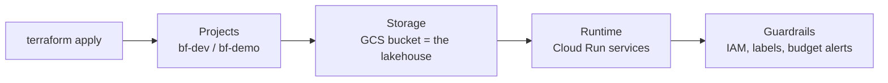
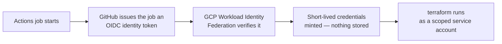

# Cloud Substrate — The GCP Footprint, Entirely in Code

> **In one line:** Two disposable GCP projects, defined by Terraform modules that mirror
> the platform's planes, reached by CI through keyless authentication.

**You are here:** START HERE › Foundation › Cloud Substrate
**Audience:** 🔴 deep dive · **Reads in:** ~6 min

## The 30-second version

The platform runs on Google Cloud, but nobody ever configures Google Cloud by hand. A
set of Terraform files describes every project, bucket, service, permission, and budget;
a pipeline applies them when changes merge. The pipeline proves who it is to Google using
short-lived tokens instead of a stored password-equivalent, so there is no powerful key
to leak. Every resource carries labels saying which layer it belongs to, which business
system's data it touches, and which environment it lives in.

## The picture



And the authentication chain that makes CI keyless:



## How it works

1. **Projects.** Two GCP projects, `bf-dev` and `bf-demo`, created and owned by
   Terraform. Same modules, different variable files — environment parity by
   construction.
2. **Storage.** One GCS bucket per environment holds the Iceberg lakehouse (warehouse
   path), plus a separate bucket for Terraform state with versioning enabled.
3. **Runtime.** Cloud Run hosts every stateless service — the MCP servers, the auth
   gateway, the A2A Risk Analyst — because it scales to zero between demos.
4. **Supporting services.** Artifact Registry stores container images; Secret Manager
   holds the few real secrets (the NVIDIA API key); Pub/Sub carries platform events.
5. **Guardrails.** IAM bindings are least-privilege per service account, every resource
   is labeled (schema below), and budget alerts fire at 50/90/100% of a small cap.

## The details

**Terraform layout mirrors the planes** — one module per plane, so the repo tree, the
architecture docs, and the cloud console all slice the same way:

```
infra/
  modules/
    data-plane/        # lakehouse bucket, Pub/Sub topics, Dagster infra
    context-plane/     # Cloud Run: mcp servers + gateway, service accounts
    agent-plane/       # Cloud Run: agent services, A2A networking
    assurance-plane/   # audit table, dashboards, alerting
    delivery-plane/    # WIF pool/provider, Actions service accounts, registries
  envs/
    dev.tfvars
    demo.tfvars
```

**Workload Identity Federation (WIF), spelled out.** OIDC (OpenID Connect) lets GitHub
give each Actions job a signed identity token naming the repo, branch, and workflow. A
GCP Workload Identity Pool is configured to trust tokens from this repo only; Google's
STS exchanges that token for short-lived credentials impersonating a deployer service
account. Attribute conditions pin the trust to `repository == "<owner>/<repo>"` and, for
apply, `ref == "refs/heads/main"` — so a fork or feature branch physically cannot deploy.
No JSON key ever exists to rotate, leak, or commit.

**Label schema** (enforced by a Terraform validation and a Gatehouse rule later):

| Key | Values | Question it answers |
|---|---|---|
| `plane` | data / context / agent / assurance / delivery | Which layer of the platform is this? |
| `system` | registry ID, e.g. `windrow-core` | Whose data/scope does it serve? |
| `env` | dev / demo | Which copy is this? |
| `serves-br` | br1…br7 | Which business requirement justifies it? |

**Cost posture.** Idle ≈ a few dollars/month (storage + registries). Demo hours are
dominated by Cloud Run request time and NIM usage (free dev tier). `terraform destroy`
is a supported, tested path — disposability is a feature, and the demo script includes a
timed cold rebuild.

## Why it's built this way

Keyless CI removes the highest-value secret from the highest-risk location (BR-7).
Plane-shaped modules make the taxonomy physical instead of aspirational — a reviewer can
`grep` a plane, bill by it, or dashboard it (see `13-taxonomy.md`). Two identical-by-
construction environments keep interview demos clean without maintaining anything twice.
And scale-to-zero runtime plus tested destroy keeps a flexible budget honest (C4), while
the `serves-br` label does something quietly unusual: it makes even the *bill* traceable
to business requirements. Decision record: ADR-008 covers the hosted-vs-self-hosted
inference path this substrate must support (C2).

## Go deeper

- `12-cicd-pipelines.md` — how plan/apply and image builds actually run
- `13-taxonomy.md` — the full slicing model these labels implement
