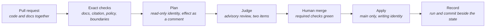

# CI/CD Pipelines — How Change Becomes Running Platform

> **In one line:** Two jobs run infrastructure: on a pull request one shows exactly what
> would change and proves it cannot change anything itself; after merge the other makes
> it real and records that it did.

**You are here:** START HERE › Foundation › CI/CD
**Audience:** 🟡 engineer · **Reads in:** ~5 min

## The 30-second version

Every change, whether application code, infrastructure, policy, or docs, arrives as a
pull request. Checks run at once: the docs standard, the requirement citation, the
policy tests, the boundary rules, the AI judge, and, for infrastructure, a preview of
what would be created or changed, posted as a comment so reviewers approve effects and
not text. The preview job holds an identity that can only read, and on every run it
proves it cannot obtain the one that can write. After a person merges, a second job with
the writing identity applies the change and leaves a record naming the run and the
commit. One flow for every kind of change is the point: there is no side door where a
quick fix skips review.

## The picture

## How it works

1. **Pull request.** Any change, any type. Branch protection makes the checks below
   required; the merge button stays gray until they are green.
2. **Exact checks.** The docs standard with its diagram rules, the requirement citation,
   the Rego policy tests, and the boundary rules (a new tool ships with its grant and
   eval; a boundary change ships with a threat-model change). Scripts only, no model.
3. **Plan.** The Terraform job formats and validates every root without credentials,
   then asks the cloud for the apply identity and asserts it was refused (the pull
   request proving on every run that it cannot deploy), then authenticates as the plan
   identity and plans the dev root. The list of what would change is posted as a
   comment, updated in place on every push.
4. **Judge.** The advisory review from `30-gatehouse/judge-lane.md`, scoring the two
   items it has earned.
5. **Human merge.** A person reads the plan and the findings and merges. Nothing merges
   with a red check, administrators included.
6. **Apply.** On main only, a job authenticates as the apply identity, plans again from
   the merged commit, applies that plan, and never runs two at once.
7. **Record.** The apply job writes a small file beside the Terraform records naming
   the run, the commit, who merged, and the plan it applied. Every change to the cloud
   maps to a merged pull request.

## The details

- **Identity split, tested.** The plan identity holds read-only project access and may
  write only the records lock. The apply identity may be assumed only by a token whose
  repository and reference equal this repository on `refs/heads/main`. The plan job
  tries to assume it on every pull request and fails the run if it succeeds; that is
  threat-model test T1-CI-02. Its first version fired on its own pull request, not
  because the binding was open but because the test was hollow: the auth action had
  reported success without ever asking Google for a token. The test now demands a real
  access token, so the refusal it asserts is a refusal that happened.
- **Concurrency.** Applies serialize on one group per environment and are never
  cancelled mid-run. A pull request plans with no lock so two open pull requests cannot
  block each other.
- **What is posted.** The comment carries the resource-level list (`# ... will be
  created`) and the plan summary line, not the full attribute diff, which stays in the
  run log. Enough to approve effects; not enough to leak a value.
- **Failure modes are chosen.** Every exact check and the plan job fail closed. The
  judge fails open while advisory and closes per item as promotion earns it (ADR-005).
- **Images.** The apply job builds the services image and the policy image from the
  merged commit, pushes them tagged with that commit, applies with that tag, and
  writes the tag beside the state. A pull request plans against the tag main last
  deployed, so its plan shows only what the pull request changes.
- **After the apply.** A successful apply on `main` starts the assurance run
  (`assurance.yml`, `20-provenance/assurance-plane.md`): a third identity, bound to
  `main` like the apply deployer and tested the same way on every pull request
  (T1-CI-05), re-scores every agent against what was just deployed.
- **Not yet built.** A `demo` environment deploys on a tagged release only, when it exists.
  Pipeline runs as evidence rows in Provenance arrive with phase 7. Code ownership
  routing for `infra/` and `policy/` is a one-file change once a second reviewer
  exists.

## Why it's built this way

Posting plans on pull requests turns infrastructure review from faith into reading
(BR-7). Required checks make BR-4's "enforced at merge" literal; enforcement that
depends on memory is not enforcement. Split plan and apply identities apply least
privilege to the pipeline itself, because automation is the most attacked doorway in a
modern supply chain, and a job that proves its own limits on every run turns a design
claim into a test (BR-8). Routing every change type through one gated flow is what
makes Gatehouse's guarantees total: a gate only counts if there is nothing to walk
around (BR-3, BR-4).

## Go deeper

- `30-gatehouse/README.md` — the gate that runs inside steps 2 and 4
- `../20-provenance/assurance-plane.md` — what runs after step 6
- `11-cloud-substrate.md` — the identities and project these jobs touch
- `../02-architecture/agent-threat-model.md` — boundary B8, the four tests on this trust
