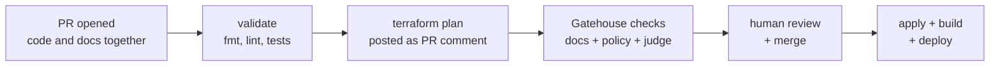

# CI/CD Pipelines — How Change Becomes Running Platform

> **In one line:** Two pipelines run everything: the PR pipeline proves a change is safe
> and shows exactly what it will do; the merge pipeline makes it real.

**You are here:** START HERE › Foundation › CI/CD
**Audience:** 🟡 engineer · **Reads in:** ~5 min

## The 30-second version

Every change — application code, infrastructure, policy, docs — arrives as a pull
request. A pipeline immediately checks it, previews its effect (for infrastructure, the
exact list of what would be created or changed is posted as a comment), and the security
gate weighs in. Only after checks pass and a human approves does the merge pipeline
apply the infrastructure and deploy the services. One flow for all change types is the
point: there is no side door where "just a quick fix" skips review.

## The picture

## How it works

1. **PR opened.** Any change, any type. Branch protection makes the following checks
   *required* — the merge button stays gray until they're green.
2. **Validate.** Formatters, linters, unit tests, `terraform validate`. Cheap failures
   fail first.
3. **Plan.** Terraform plans against the dev environment with read-only credentials and
   posts the human-readable diff as a PR comment — reviewers approve *effects*, not just
   text.
4. **Gatehouse.** The gate runs its deterministic lane (and, once trusted, its judge) as
   status checks — this is where `30-gatehouse/` plugs into the foundation.
5. **Human review + merge.** CODEOWNERS routes security-relevant paths (`infra/`,
   `policy/`, `gatehouse/`) to required reviewers.
6. **Apply + deploy.** On main only: `terraform apply` with the write-scoped identity,
   container builds pushed to Artifact Registry, Cloud Run services rolled with
   revision-based rollback available.

## The details

- **Identity split.** The PR pipeline exchanges its OIDC token for a *plan-only* service
  account; the merge pipeline gets the *apply* account, and Workload Identity Federation (WIF) attribute conditions
  restrict apply to `main` (see `11-cloud-substrate.md`). Compromising a PR cannot
  deploy.
- **Concurrency.** Applies serialize on a per-environment concurrency group; a stale
  plan (base branch moved) is detected by plan-file hash and re-planned rather than
  applied.
- **Failure modes are chosen, not accidental.** Validation and deterministic Gatehouse
  checks *fail closed* (red blocks merge). The non-deterministic judge starts *fail
  open* (advisory comment) and only gains fail-closed status per rubric item as its
  measured precision earns it — the promotion mechanism lives in
  `33-trust-machinery.md`.
- **Provenance hook.** Every pipeline run emits a structured event (check name, verdict,
  versions, duration) to Pub/Sub; Provenance ingests these as evidence rows — CI is a
  sensor, and gate history becomes audit material (BR-7).
- **Environments.** Merge deploys dev automatically; `demo` deploys on a tagged release
  only, keeping the interview environment stable mid-conversation.

## Why it's built this way

Posting plans on PRs turns infrastructure review from faith into reading (BR-7).
Required checks plus CODEOWNERS make BR-4's "enforced at merge" literal — enforcement
that depends on memory isn't enforcement. Split plan/apply identities apply least
privilege to the pipeline itself, because CI is the most attacked doorway in modern
supply chains. And routing every change type through one gated flow is what makes
Gatehouse's guarantees total: a gate only counts if there's nothing to walk around
(BR-3, BR-4).

## Go deeper

- `30-gatehouse/README.md` — the gate that runs inside step 4
- `11-cloud-substrate.md` — the identities and projects these pipelines touch
