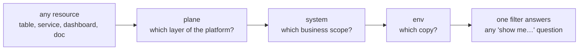

# Taxonomy — One Way to Slice Everything

> **In one line:** Three labels — plane, system, environment — categorize every resource,
> table, dashboard, and doc, so any question about the platform starts with the same
> three-part filter.

**You are here:** START HERE › Foundation › Taxonomy
**Audience:** 🟡 engineer · **Reads in:** ~5 min

## The 30-second version

A platform with many moving parts needs one consistent way to answer "what is this, and
what does it belong to?" Here, everything is categorized on three independent axes.
**Plane** says which layer of the platform it is (moving data, serving context, running
agents, assuring quality, or delivering change). **System** says which business system's
data or scope it serves — the same way security compliance draws an "authorization
boundary" around a system. **Environment** says which copy it is (dev or demo). Same
three labels in the cloud, in the data tables, in the dashboards, and in the repo tree.

## The picture



## How it works

1. **Any resource.** A table, a service, a dashboard, a doc: everything the platform
   creates gets the same four labels at birth.
2. **Plane — five values, fixed.** `data` (sources → pipelines → lakehouse), `context`
   (Model Context Protocol, MCP, servers + gateway), `agent` (the workflows), `assurance` (policy, audit, evals,
   observability), `delivery` (CI/CD, infrastructure as code, Gatehouse). Planes slice the *platform*.
3. **System — open set, registered.** Blackfork's ~40 services roll up into a handful of
   registered systems (e.g., `windrow-core`, `windrow-edge`, `corp-it`). Systems slice
   the *evidence and scope*.
4. **Environment — `dev` or `demo`.** Environments slice the *copies*.
5. **One filter answers any question.** Applied everywhere: GCP labels, Iceberg table properties and a `system_id` column
   on every evidence/finding row, Grafana dashboard variables, and the repo tree (planes
   as folders).

## The details

**The System Registry** is a small, first-class dataset (a seeded Gold table plus a YAML
source of record in git):

```yaml
- system_id: windrow-core
  name: Windrow Core Platform
  owner: platform-eng
  data_sensitivity: cui        # drives policy: see ADR-006, ADR-008
  frameworks: [soc2, 800-171]
  services: [api, ingest, scheduler, ...]
```

Every evidence row, finding, control status, and generated packet carries `system_id`.
Audit packets are generated *per system* — which is exactly how System Security Plans
(SSPs) and assessments actually scope in the real world. The registry also drives
policy: a system tagged `cui` routes agent inference to the self-hosted path (C2) and
tightens which MCP tools the policy engine (OPA) will allow.

**Why three axes and not one big category tree:** the axes are orthogonal. "Context
plane" resources exist for every system; "windrow-core" evidence exists in every plane.
A tree forces one hierarchy and breaks the other; independent labels let you ask both
questions — and their intersections — cheaply:

- *"Everything in the context plane for windrow-core in dev"* → one console filter, one
  SQL `WHERE`, one dashboard variable set.
- *"What does the demo env cost, by plane?"* → billing export grouped by labels.
- *"Which systems still lack a threat model?"* → registry join against Gatehouse
  coverage data (BR-4).

## Why it's built this way

Categorization is what keeps "multiple systems" from becoming "one tangle": the plane
axis gives the build its chunks (each plane = a Terraform module, a docs section, a
dashboard row), while the system axis gives the *product* its meaning — evidence scoped
the way assessors actually ask for it (BR-1, BR-5). Making the registry data rather than
convention means scope rules are enforceable by policy, not memory (BR-7). And one
taxonomy spanning cloud, lakehouse, dashboards, and repo means a reviewer can pull the
same thread from any starting point and land in the same place.

## Go deeper

- `11-cloud-substrate.md` — the label schema as implemented in Terraform
- `20-provenance/README.md` — how `system_id` flows through evidence to packets
