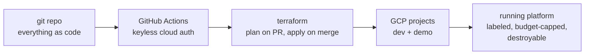

# Foundation — What Both Systems Stand On

> **In one line:** Before Provenance or Gatehouse exist, three things do: a documentation
> spine, a cloud substrate defined entirely in code, and the CI/CD pipelines that build
> everything else.

**You are here:** START HERE › Foundation
**Audience:** 🟡 engineer · **Reads in:** ~4 min

## The 30-second version

Nothing in this project is clicked together in a cloud console. The whole platform — the
projects, storage, services, permissions, budgets — is described in code, reviewed like
code, and stood up by an automated pipeline when changes merge. That means anyone can
rebuild the entire environment from a fresh clone, tear it down when idle, and trust that
what's running matches what's written. The foundation is that machinery, plus the
labeling system that keeps a multi-part platform organized.

## The picture

## How it works

1. **Everything lives in git** — Terraform for infrastructure, Rego for policy, Python
   for pipelines, YAML for CI, OSCAL for control catalogs, markdown for docs. There is
   no second source of truth.
2. **GitHub Actions authenticates to Google Cloud without stored keys** using Workload
   Identity Federation (details in `11-cloud-substrate.md`).
3. **Terraform runs in two modes:** on every pull request it *plans* and posts the diff
   as a PR comment for review; on merge to main it *applies*.
4. **Two GCP projects** keep environments honest: `dev` for building, `demo` for clean
   interview runs.
5. **The result is disposable on purpose:** the full platform stands up in ~20 minutes
   and tears down to near-zero cost when idle.

## The three foundation chunks

- **F1 — Docs spine.** The business case, diagrams, architecture narrative, ADR log, and
  the standard they all follow. Documentation is a deliverable here, not an afterthought.
- **F2 — Cloud substrate** (`11-cloud-substrate.md`). The Terraform-managed GCP
  footprint: projects, lakehouse storage, runtime, secrets, registries, labels, budgets.
- **F3 — CI/CD** (`12-cicd-pipelines.md`). The pipelines that validate, plan, gate,
  apply, build, and deploy — the same pipelines Gatehouse will later attach to.

Plus the organizing scheme both systems share: **the taxonomy**
(`13-taxonomy.md`) — planes, systems, environments.

## Why it's built this way

Everything-as-code isn't style; it's three requirements wearing one solution. Rebuild-
from-clone keeps costs near zero for a portfolio that must stay cheap (C4). Reviewable
infrastructure is itself a security control — changes to IAM or networks go through the
same gated PR flow as application code, which is what lets Gatehouse govern *all* change,
not just app change (BR-4, BR-7). And a keyless CI/CD trust chain removes the classic
worst secret — a long-lived cloud key sitting in repo settings (BR-7). The taxonomy
exists because a platform with five planes, multiple business systems, and two
environments becomes unnavigable without one consistent way to slice it.

## Go deeper

- `11-cloud-substrate.md` — the GCP footprint and the keyless auth chain
- `12-cicd-pipelines.md` — the PR pipeline and the merge pipeline, step by step
- `13-taxonomy.md` — planes × systems × environments, and the label schema
