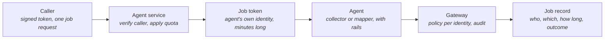

# Agent Plane — Agents as a Service, One Job at a Time

> **In one line:** Every agent job enters through a signed-token door with a quota per caller, runs under its own short-lived identity with its own grant, and leaves a record; the Control Mapper is the first agent to join the Evidence Collector there.

**You are here:** START HERE › Provenance › Agent Plane
**Audience:** 🟡 engineer · **Reads in:** ~6 min

## The 30-second version

Until now the Evidence Collector ran as a one-off process that someone started by
hand. The agent plane turns agents into a service: a caller presents a signed token
naming who they are and asks for one job from one agent. The service checks the token,
checks that this caller has not used up their allowance, mints a fresh token for the
agent's own identity that lasts only as long as the job, runs the job behind the same
guardrails as before, and writes down who asked, which agent ran, how long it took, and
what happened. The caller's identity and the agent's identity are different on
purpose: a caller may ask for a job, but only the agent's identity is granted tools at
the door. The second agent, the Control Mapper, reads a control's requirement and the
evidence held for it and drafts the statement an assessor will read, citing every row
and the control id it read, and saying plainly when there is nothing to cite.

## The picture

## How it works

1. **Caller.** Anything that wants a job done: the eval runner, a person's script, later
   the Report Writer asking the mapper for statements. It carries a token for its own
   identity, signed with the key the gateway trusts.
2. **Agent service.** Verifies the caller's token, refuses a bad or missing one, and
   applies the caller's quota: thirty jobs an hour by default, a bucket per caller, so
   one caller's flood cannot exhaust another's allowance. A refused request is recorded
   like any other.
3. **Job token.** For an accepted job the service mints a token for the agent's own
   identity, valid for fifteen minutes. The caller never holds it.
4. **Agent.** The Evidence Collector takes a question; the Control Mapper takes a system
   and a control. Both run behind the input and output guardrails, with the same
   toolkit workflow and a prompt written for their job.
5. **Gateway.** Every tool call carries the job token, so policy decides per agent
   identity and the audit trail names the agent, not the caller. The mapper's grant is
   narrower than the collector's: it reads evidence and controls, and cannot fetch a
   single row by id or search the catalog.
6. **Job record.** One line per job: who asked, which agent, a hash of the input rather
   than the input, whether a rail blocked it, how long it took, and the outcome.

## The details

**The Control Mapper.** Its prompt tells it to read the control's requirement first,
then the evidence, then write two to four sentences on how the requirement is met,
citing the row id of every piece of evidence it relies on and the control id it read.
If the evidence call returns nothing, it says no evidence is held and cites nothing.
Two eval cases hold it to that: one control with evidence, where the statement must
cite the two rows and the control; one control with none, where the answer must say so
and no row id may appear.

**The quota, and why it lives here.** The threat model's caller-quota row waited
through two phases because a one-question-per-process agent has nowhere to keep a
count. A service does. The quota is the same token-bucket the gateway uses for its
per-identity limit, keyed by caller.

**What the record holds and what it does not.** The record holds a hash of the input,
never the input: questions can carry the very text the redaction rules keep out of
storage. The durable, chained record of what an agent actually did is the gateway's
audit trail; the job record is the index to it.

**Where it runs.** On Compose, `agent-service` on the edge network with the gateway and
the trace collector, port 8080, jobs recorded under `jobs/`. On Cloud Run, `agents-dev`
at scale to zero, open on the network because it checks its own tokens, with the
signing key and the model key from Secret Manager and one instance holding the quota
buckets. The eval runner can post its cases to either with `--via-service`.

**The Risk Analyst, isolated.** The third job type, the assessor, is the investigation
workflow: the service reads the requirement and the evidence through the gateway as
the mapper, has the mapper draft its statement, assembles the finding, and sends it to
the Risk Analyst. The analyst is a separate service with its own signing key, reached
over the agent-to-agent protocol's shape (an agent card and `message/send`), holding
no identity at the gateway, no gateway address, no bucket, and on Compose no route to
any of them; in the cloud only the agent service's identity may invoke it, and it
checks its own token on top. Its score is deterministic, computed from facts about the
evidence: how many rows, how many sources, how fresh, whether the statement cites rows
that exist. Text is input to the explanation only, so an instruction planted in a
statement cannot move the number, and a test proves it. The explanation is written
afterwards by the model and checked to still name the severity and score it was given
(ADR-004). Evals: both workflow cases pass locally, in process and through the service: the evidence case rated low with both rows cited from two corroborating sources, the no-evidence case rated high.

**What is not here yet.** The Report Writer and the human signature (the next pull
request, ADR-007), and token spend per job, which the runner does not yet surface; the
workload profile measured it through a proxy instead.

## Why it's built this way

Agents that a person starts by hand cannot be quota'd, audited per caller, or composed
into a workflow; a service can (BR-3). Separating the caller's identity from the
agent's keeps the policy about agents and the accountability about callers, and a
job-long token means a leaked one is worth minutes (BR-7, BR-8). The mapper exists
because a packet needs statements that cite what they rest on, and an agent that
reads the control text and the evidence before writing produces exactly that (BR-2).

## Go deeper

- `context-plane.md` — the door every job's tool calls go through
- `v1-slice.md` — the Evidence Collector and the guardrails both agents share
- `../02-architecture/agent-threat-model.md` — B1 rows for the caller door and the quota
