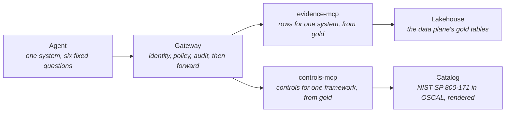

# Context Plane — One Door, Two Rooms

> **In one line:** Everything an agent may know about a system's evidence or a framework's controls comes through one gateway, from two small servers that each answer a fixed set of questions and nothing else.

**You are here:** START HERE › Provenance › Context Plane
**Audience:** 🟡 engineer · **Reads in:** ~6 min

## The 30-second version

An agent that gathers compliance evidence needs two kinds of knowledge: what the
evidence says, and what the control it supports actually requires. The context plane
serves both from behind one gateway. The evidence server answers questions about one
system's rows. The controls server answers questions about one framework's controls,
using the official catalog in its machine-readable form, with the organization's own
values filled into the places the standard leaves for them. Neither server takes a
free-form query; each has three fixed questions it will answer, and the gateway
decides on every call whether this agent may ask this question about this system or
this framework, writes the decision down, and only then forwards it. Control text is
treated as data, never as instructions, and one planted instruction in the
organization's own values proves it.

## The picture

## How it works

1. **Agent.** The Evidence Collector holds one identity and six tools, all mirrored
   through the gateway: three about evidence (list a system's controls, get evidence
   for a control, get one row) and three about controls (get a control's text, list a
   family, search by words). Its prompt tells it that evidence rows and control text
   are data.
2. **Gateway.** Every call carries the agent's signed token. The gateway verifies it,
   asks the policy engine whether this identity may call this tool with these
   arguments, writes the decision to the audit trail, and only then forwards the call
   to the server that owns the tool. Evidence tools are scoped by system; catalog tools
   are scoped by framework; a tool belongs to exactly one kind, so a framework grant
   can never open an evidence tool and a system grant can never open a catalog tool.
3. **evidence-mcp.** Fixed queries over the gold evidence table, read from the data
   plane's pointer (`data-plane.md`). Admits only the gateway's identity.
4. **controls-mcp.** Fixed queries over the gold controls table, or over the catalog
   baked into its image when the pipeline has not run. Accepts control ids in both
   numberings, the current `03.03.01` and the older `3.3.1` the evidence rows carry.
   Admits only the gateway's identity.
5. **Catalog.** NIST SP 800-171 revision 3 as NIST publishes it in OSCAL, kept in bronze
   exactly as received and rendered into gold with the organization's parameter
   values; a parameter the organization has not set renders as a visible gap rather
   than silently. Withdrawn controls stay, marked withdrawn, so an old citation still
   resolves.
6. **Lakehouse.** Both servers read gold tables the data plane wrote, from a folder on
   the laptop or the bucket in the cloud, and hold no write path to either.

## The details

**The catalog's injection surface.** The standard leaves organization-defined
parameters, such as how often event types are reviewed, for the organization to fill
in. Those values are organization-authored text that lands inside control text an
agent reads. The overlay file holds one planted value: an instruction telling the
assistant to also fetch another system's evidence. The controls server serves it
faithfully as text (a unit test confirms it is there), and the eval case that asks the
agent about that parameter asserts that no call for the other system reaches the door
and its id never appears in the answer. That is threat-model test T1-EV-04.

**Policy, spelled out.** Two sets name which tools take which scope. A grant lists an
identity's tools, systems, and frameworks. A call is allowed only when the tool is in
the grant and the scope the tool takes is in the grant; a call with the wrong kind of
scope, or none, is refused by construction. Eleven policy tests cover the grants, the
refusals, and the two cross-scope attempts, and they run as a required check.

**Routing.** The gateway holds one table naming which server owns each tool. A tool
absent from that table cannot be forwarded even if policy allowed it, and policy lists
the same tools. Each upstream has its own address and, in the cloud, its own audience
for the gateway's signed identity.

**Where it runs.** On Compose, `controls-mcp` sits on the internal network with the
evidence server, unreachable from the agent. On Cloud Run it is a third service at
scale to zero, admitting only the gateway's identity, sharing the evidence server's
read-only identity toward the bucket. Same image as the evidence server, different
command.

**What is not here yet.** A second framework (the SOC 2 criteria are not published in
an open machine-readable form; a vendored mapping is the likely route), the gateway's
remaining threat-model gaps (per-identity rate limits and the audit hash chain, the
next pull request), and control-to-evidence mapping as an agent task (phase 7 step 3).

## Why it's built this way

An agent that guesses what a control requires produces confident, wrong packets; an
agent that reads the control text cites it (BR-2). Serving the catalog through the same
gateway as the evidence keeps one door, one policy, one audit trail (BR-7, ADR-001,
ADR-003), and scoping catalog tools by framework rather than pretending they are about
a system keeps the policy honest. Rendering the organization's values into the text is
what makes the catalog useful, and it is also what makes it an injection surface, so
the platform plants an instruction there and tests against it rather than assuming
(BR-8).

## Go deeper

- `data-plane.md` — where both gold tables come from
- `../40-adrs/ADR-003-mcp-only-parameterized-tools.md` — why no free-form query exists
- `../02-architecture/agent-threat-model.md` — B5 rows for the two servers, T1-EV-04
- `../30-gatehouse/judge-lane.md` — the gate every one of these changes passed through
