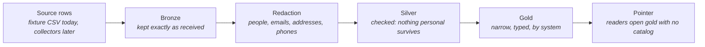

# Data Plane — Evidence In, Redacted, Ready to Serve

> **In one line:** Evidence lands as received, loses every trace of personal data before it is stored for reading, and is served from a narrow table that any reader can open without asking a catalog.

**You are here:** START HERE › Provenance › Data Plane
**Audience:** 🟡 engineer · **Reads in:** ~6 min

## The 30-second version

Provenance runs on evidence: audit-log entries, scanner results, configuration
snapshots. Each arrives as a row that says which system it is about, which control it
supports, where it came from, and a sentence of summary. The data plane is the path
those rows take. First they are kept exactly as they arrived. Then every sentence a
person may have written is scanned, and names, email addresses, network addresses, and
phone numbers are replaced with labels, before the row is stored anywhere an agent can
read. Then the rows are shaped into the one narrow table the evidence server serves.
Each step is a job with a check that fails the run if its promise is broken: nothing
personal survives into the second layer, every row names a registered system, and the
three layers hold the same rows. The same code writes to a folder on a laptop or to the
cloud bucket; only two settings change.

## The picture



## How it works

1. **Source rows.** Today the thirteen fixture rows plus three planted with personal
   data so the redaction has something to catch. Later, the collectors of phase 7 write
   here.
2. **Bronze.** The rows as received, as an Iceberg table. Nothing is changed, so a
   dispute about what a source actually said can always be settled.
3. **Redaction.** Every free-text field is scanned. Names come from a language model,
   addresses and numbers from patterns, and each hit is replaced with a typed label
   such as `<PERSON>` or `<EMAIL>`. Identifiers the platform runs on, control ids and
   system ids, are never touched (ADR-006).
4. **Silver.** The redacted rows, and the check: silver is scanned again, by the
   redactor's detector and by an independent set of plain patterns that do not share
   its blind spots. Anything found by either fails the run.
5. **Gold.** The narrow, typed view the evidence server serves, partitioned by system.
   Two checks: every row names a system in the registry, and bronze, silver, and gold
   hold the same row ids.
6. **Pointer.** Each table publishes the location of its current metadata file beside
   itself. A reader loads the table from that file alone: no catalog service, no
   credentials beyond the right to read the folder or the bucket.

## The details

**Where it lives.** `src/provenance/data/`: `lakehouse.py` (tables, catalog, pointer),
`redact.py` (the redactor and the pattern layer), `assets.py` (the three assets and
three checks as Dagster definitions), `run.py` (one run, checks included, non-zero exit
on any failure), `systems.yml` (the registry). Tests in
`src/provenance/tests/test_data_plane.py` run the whole pipeline on a temporary
warehouse and assert each promise.

**Run it.** The data plane has its own environment, because the redaction library and
the agent toolkit disagree on shared dependencies:

```
py -3 -m venv .venv-data && .venv-data/Scripts/pip install -r src/requirements-data.txt
cd src && ../.venv-data/Scripts/python -m provenance.data.run
```

That writes `data/warehouse/` and `data/catalog.db` on this machine, for the tests and
for a laptop-only look. Set `LAKEHOUSE_WAREHOUSE=gs://<bucket>/warehouse` and the same
run writes to the cloud with whatever identity the shell holds.

**One writer environment per warehouse.** Iceberg records absolute locations: the
pointer names the metadata file, and the manifests name every data file. A warehouse
written from the host under `file:///C:/...` cannot be read from a container that
mounts the same folder at `/data`, and the first Compose test proved it by falling back
to the baked fixture. So the Compose evidence server reads a warehouse written by the
Compose pipeline, in its own container, at the same address both see:

```
docker compose --profile data run --rm dagster python -m provenance.data.run
docker compose restart evidence-mcp
```

Delete `data/warehouse/` and `data/catalog.db` before switching a folder from one
writer to the other. In the cloud there is no such split: writer and reader both use
`gs://<bucket>/warehouse`. The Dagster user interface runs the same container:
`docker compose --profile data up dagster`, then open port 3000.

**Layers as Iceberg tables.** Iceberg gives each layer a schema, snapshots, and a
metadata file that fully describes the table's current state (ADR-002). The pipeline
writes through a small SQLite catalog so tables can be found by name; readers never
need it, because the pointer names the metadata file directly. Gold is partitioned by
`system_id`, so a reader that wants one system's rows touches one system's files.

**What the redactor looks for, and what it leaves alone.** Four entity types: people,
email addresses, IP addresses, phone numbers. That set is deliberately short. A wider
net starts redacting control names, framework titles, and system ids, which are the
platform's own vocabulary. The planted rows show the effect: `Approved by Jane Doe
(jane.doe@windrow-corp.com) from 10.20.30.40` becomes `Approved by <PERSON> (<EMAIL>)
from <IP>`. A row with nothing to redact is byte-for-byte unchanged.

**The redactor's other failure mode.** Over-reach. On the first full scan the language
model read "Suricata", the sensor engine named at the start of two summaries, as a
person's name and erased it, which damages evidence as surely as leaking it. The
redactor now carries a short allow list of the platform's own vocabulary, each entry
added because a row proved the need, and a test holds the line.

**The check that does not trust the redactor.** A check that re-ran the same detector
would pass whenever the detector was blind. The silver check runs two: the redactor's
own, and plain patterns for the structured kinds. The first pipeline run showed why
this matters: a planted phone number was too short to be a real number, the detector
ignored it, and the redactor-only check passed. The pattern layer would have failed it.

**The evidence server reads gold.** At startup the server loads the gold table from
its pointer into memory and serves from there: the local folder on the laptop, the
lakehouse bucket on Cloud Run, where its identity holds bucket read and nothing else.
If no pointer exists yet, it serves the fixture baked into its image and says so in its
log, so a fresh deploy answers before the pipeline has ever run. The reader needs
neither the catalog library nor a database driver; the first container build proved
that by crashing when the reader imported the writer's catalog at module load.

**What is not here yet.** Collectors that write bronze from real sources, the schedule
that runs the pipeline, and a reload when the pointer changes (today a new gold table
is picked up on the next start, which at scale to zero is the next request after
idle). These come with the rest of phase 7.

## Why it's built this way

Evidence has to be kept as received (BR-1) and served narrowly to agents that must
never see more than they need (BR-7). Redacting before storage, rather than at read
time, means there is no unredacted copy anywhere an agent can reach, and a check that
does not share the redactor's blind spots turns that promise into a test (ADR-006).
Iceberg on object storage is the cheapest lakehouse there is: files in a bucket, no
service to run, cents while idle (BR-2, C4), and a pointer beside each table keeps
readers free of a catalog service they would otherwise depend on. Every row carrying a
registered `system_id` is what lets packets be generated per system later (BR-2).

## Go deeper

- `../40-adrs/ADR-002-iceberg-lakehouse.md` — why Iceberg files in a bucket
- `../40-adrs/ADR-006-redaction-before-storage.md` — why redaction happens before silver
- `v1-slice.md` — the slice that reads what this plane produces
- `../10-foundation/13-taxonomy.md` — the registry every row must satisfy
