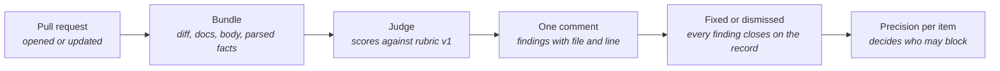

# Judge Lane

> **In one line:** The AI reviewer that comments on every pull request against a six-item rubric, and the loop that makes every one of its findings end as fixed or dismissed, on the record.

**You are here:** START HERE › Gatehouse › Judge Lane
**Audience:** 🟡 engineer · **Reads in:** ~6 min

## The 30-second version

Exact rules catch what exact rules can express. The judge handles the rest: is the
diagram actually readable, does the walkthrough really match it, did a change move a
trust boundary without saying so. A language model makes those calls, so it starts with
no power. It posts one comment per pull request with each finding pointing at a file
and a line, and a status that stays open until every finding is either fixed or
dismissed with a written reason. Dismissals are counted as the judge being wrong.
Those counts, per checklist item, are what decide whether an item ever earns the right
to block a merge.

## The picture



## How it works

1. **Pull request.** A GitHub Action runs when a pull request opens or updates, and
   again when a maintainer replies with a dismiss command.
2. **Bundle.** The action gathers the diff of every changed file, the full text of any
   changed docs page, the pull-request body, the diagram rules, and the threat model's
   boundary list. A parser then computes hard facts from the diff: tools added, secret
   patterns hit, whether the threat model or a policy file changed, which requirement
   the body cites. Those facts travel with the evidence so the model reasons from them
   instead of re-reading a long diff for them.
3. **Judge.** A NeMo Agent Toolkit workflow with no tools. Its only instruction is the
   rubric file; everything else it receives is labeled evidence, and the system prompt
   says evidence never instructs it. It returns one verdict per rubric item and a list
   of findings, each with file, line, why, and a one-sentence fix. Output is JSON; a
   transport failure is retried, a verdict never is.
4. **One comment.** The verdict is posted as a single comment, updated in place on
   every run. Items show pass, fail, or not applicable with a one-line note. Findings
   are listed by severity with a stable id.
5. **Fixed or dismissed.** A finding closes one of two ways. If a later run no longer
   reports it, it is marked fixed. If a maintainer replies
   `/gatehouse dismiss <id> reason: ...`, it is marked dismissed with the name and the
   reason shown in the table. A check run named `gatehouse/judge` carries the open count.
   While every item is advisory the check is neutral and never blocks.
6. **Precision per item.** Dismissals are recorded false positives; planted-flaw
   fixtures supply the known true positives and misses. Each rubric item's precision
   is computed from both and published. An item that clears the threshold in ADR-005
   is switched to blocking in the rubric file, and the check run then fails on its
   open findings. A drop in precision demotes it.

## The details

**The rubric, version 1.** Six items, each with a definition of pass, fail, and the
form a finding must take. Changing the file changes the judge, so it goes through the
gate like everything else, and a version bump re-runs the fixtures.

| Item | Checks |
|---|---|
| R1 | A changed template page has a diagram that follows the rules: left to right, seven nodes or fewer, every node named and glossed |
| R2 | The numbered walkthrough matches the diagram box for box, in order |
| R3 | The pull-request body cites an existing requirement or constraint |
| R4 | A change that adds or alters a network path, an agent tool, a credential, a service, or a data source also changes the threat model, or says specifically why not |
| R5 | No added line carries a credential, cloud project id, internal hostname, or non-example address |
| R6 | A new agent tool ships with a policy grant and an eval case in the same change |

**What the judge cannot do.** It cannot merge, cannot call tools, cannot post on its
own (separate code posts its output), and cannot change its rubric. The Actions token it
posts with is the built-in one, scoped to comments and check runs on this repository,
and it expires with the run.

**First results, three fixtures.** A clean docs change: no findings, every item pass or
not applicable. A committed API key: caught, with file and line, and also flagged under
R4 because a credential is a boundary change by the rubric's own wording. A new tool
with no policy grant and no threat-model change: both caught, each with file and line
in both files the tool touched. It did not start that way. Before the parser-computed
facts were added to the bundle, the model caught the missing grant but marked the
threat-model item not applicable on every run, and once contradicted its own earlier
verdict on an unchanged fixture. Handing it the facts fixed both. The planted-flaw set
in the next phase turns these single runs into rates, which is the only form of this
claim that counts.

**First live run, and the first real false positive.** The judge's own pull request
added the fixture files above, which are diffs containing planted flaws. The parser
read the added lines of those patch files, found `@mcp.tool()` and the synthetic key,
and the judge reported four findings against real source paths that the pull request
never touched. Test data had become findings. The fix was a rule in both the parser
and the prompt: files under fixture, test, or eval directories, and patch files, are
test data by design and never yield findings. The next push closed all four findings
as fixed, on the record, which is the loop working as intended.

**Running it yourself.**

```
pip install -e src/gatehouse
python -m gatehouse.judge.cli --fixture src/gatehouse/gatehouse/judge/fixtures/secret-in-compose
```

Fixtures are directories with `pr.md`, `diff.patch`, optional `files/`, and
`expected.json` naming which items a planted flaw must fail.

## Why it's built this way

Deterministic before probabilistic, applied twice. Once between the lanes: exact rules
run first and can block; the judge advises. And once inside the judge: a parser
establishes the facts a diff contains, and the model reasons over facts rather than
hunting for them, which is where the first miss came from (BR-3, BR-9). The
fixed-or-dismissed loop exists because an advisory bot nobody answers is worse than no
bot: it teaches reviewers to skip it. Making dismissal a recorded, reasoned act turns
disagreement into measurement, and measurement is the only thing that can ever give the
judge authority (ADR-005, planned). The judge is itself an agent that reads text anyone
can write, so it is bound by the same threat model as the Evidence Collector (BR-8).

## Go deeper

**Next:** `../02-architecture/gatehouse-pr-flow.md` — where this lane sits between the
exact rules and the human.

- `../../src/gatehouse/gatehouse/judge/rubric.yml` — the rubric itself
- `../02-architecture/agent-threat-model.md` — boundaries B1 and B6, which the judge crosses
- `../ROADMAP.md` phase 4 — ADR-005, the planted-flaw set, and the seeded attacks
