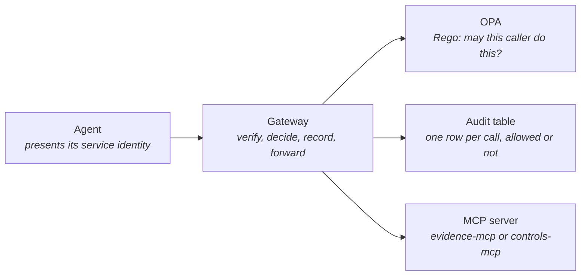

# ADR-001 — A custom auth and audit gateway in front of every MCP server

**Status:** accepted
**Serves:** BR-7, BR-8
**Date:** 2026-09-06

## Context

MCP is the only way an agent in this platform may reach data (ADR-003, planned). That
choice only means something if the door is guarded: every call must be tied to an
identity, checked against policy, and written down, including calls that are refused.
Three facts shape the decision.

1. **The framework does not guard the door for us.** NeMo Agent Toolkit can serve a
   workflow as an MCP server and can call MCP servers as a client, but its MCP front end
   ships without server-side authentication or authorization. Anything that can reach
   the port can call the tools.
2. **The callers are not trustworthy by construction.** The agents read scanner output,
   log lines, and pull-request diffs, all of which an attacker can influence. A steered
   agent will ask for data it should not have. The protection has to sit outside the
   agent, where the agent's reasoning cannot switch it off (BR-8).
3. **The auditor's first question is about the automation itself.** "Why should I
   believe the robot?" is answered by a record of every call the robot made, who it was
   acting as, and whether policy allowed it (BR-7). That record has to be produced by
   something other than the agent.

## Decision

Put a small, custom gateway in front of every MCP server. Agents never connect to an
MCP server directly; network policy allows MCP servers to accept connections only from
the gateway. On every call, in this order:

1. **Verify identity.** The caller presents a signed service token. The gateway checks
   the signature, expiry, and audience, and resolves the caller to a named agent
   identity. Unsigned or unknown callers are refused before anything else happens.
2. **Validate the request against the tool schema.** The tool name must exist and the
   arguments must match the tool's declared schema. There is no free-form query
   parameter to validate; tools are parameterized by design (ADR-003, planned).
3. **Ask OPA.** The gateway sends caller identity, tool name, and arguments to OPA. Rego
   policy answers allow or deny. Policy is default deny: a tool or argument combination
   with no rule is refused. Rules can constrain arguments, for example restricting a
   caller to a single `system_id`.
4. **Write the audit row.** Caller, tool, arguments, decision, policy version, and
   timestamp are written to an append-only audit table before the call is forwarded.
   Denied calls are written too. If the audit write fails, the call fails.
5. **Forward and return.** Allowed calls are forwarded to the MCP server; the response
   goes back to the agent unchanged.

The gateway is deliberately thin. It holds no business logic, no data, and no model.
Policy lives in Rego files in this repo; identity lives in the platform's service
credentials; the audit table lives in the lakehouse. The gateway only connects them.

## Consequences (including what we gave up)

- **BR-7 becomes physically true.** Every agent action on data is in the audit table
  with an identity and a policy decision attached. The audit table is itself evidence
  Provenance can serve.
- **BR-8 becomes testable.** Containment claims have a place to be checked: an
  adversarial eval that steers an agent toward another system's data should produce a
  denied row in the audit table, not data. That is a concrete assertion.
- **The security team changes rules without redeploying agents.** Rego files are
  versioned, reviewed through Gatehouse, and reloaded by OPA.
- **An extra hop on every call.** One network round trip plus an OPA decision plus a
  database write. Budget: under 20 ms at the 95th percentile locally; the workload
  profile (BR-9) will measure it.
- **Custom code we must maintain and defend.** The gateway is now part of the attack
  surface and gets its own boundary (B3) in `../02-architecture/agent-threat-model.md`;
  the STRIDE sketch below was its seed and the threat model now carries the status of
  every test.
- **Fail closed.** If OPA or the audit table is unreachable, calls fail. The platform
  prefers a stalled agent to an ungoverned one. This will surface as availability
  incidents in development, and that is accepted.
- **We gave up the vendor path for now.** When the toolkit ships server-side
  authentication, this decision should be revisited, not silently kept. See
  Alternatives.

## Alternatives considered

| Alternative | Why not |
|---|---|
| **Wait for the framework.** Use NeMo Agent Toolkit's MCP front end as-is and adopt its authentication when it ships. | Leaves the door open for the whole build. Policy and audit are the platform's core argument, not a later feature. Revisit when the framework's auth lands; supersede this ADR if it covers identity, policy, and audit. |
| **Authenticate inside each MCP server.** Add token checks and audit writes to `evidence-mcp` and `controls-mcp` themselves. | Duplicates the logic per server, and every new server can forget it. A single choke point is the only way to make "every call" a fact rather than a convention. |
| **Network isolation only.** Put MCP servers on a private network reachable by agents and rely on that. | No identity, no per-call policy, no audit. A steered agent on the private network is still a steered agent with full access. |
| **A commercial API gateway.** Kong, Apigee, or a cloud provider's gateway with an OPA plugin. | Idle cost and platform weight for a portfolio running at near-zero (C4). The behavior needed is small enough that a thin custom service is less to operate and easier to read. |
| **Put policy in the agent's prompt.** Tell the agent which data it may request. | Instructions are the very thing prompt injection overrides. Policy has to be enforced by something the model cannot argue with. |

## STRIDE sketch of the gateway

This is the seed of the agent-runtime threat model. Each row gets a test ID that the
threat model expands and the eval sets implement.

| Threat | Example | Mitigation in this design | Test |
|---|---|---|---|
| **Spoofing** | A process presents a forged or replayed token to act as the Evidence Collector | Signed tokens with expiry and audience; unknown identities refused before policy runs | T1-GW-01: replayed and forged tokens are denied and audited |
| **Tampering** | Arguments altered in transit, or a tool name that does not exist | Schema validation before policy; mutual TLS between agent and gateway | T1-GW-02: malformed and off-schema calls are refused |
| **Repudiation** | An agent's call cannot later be tied to a decision | Audit row written before forwarding; denied calls recorded; policy version stored per row | T1-GW-03: every eval call appears in the audit table with its decision |
| **Information disclosure** | Sensitive arguments or results leak through gateway logs | Gateway logs decisions, not payloads; redaction happens before storage (ADR-006, planned) so results carry no personal data | T1-GW-04: log output contains no result payloads |
| **Denial of service** | A looping agent floods the gateway | Per-identity rate limits; fail closed under overload | T1-GW-05: a runaway caller is throttled and audited, other callers unaffected |
| **Elevation of privilege** | A steered agent requests another system's evidence or a tool outside its role | Default-deny Rego; argument-level constraints per identity | T1-GW-06: cross-`system_id` and out-of-role calls are denied in the adversarial eval set |
