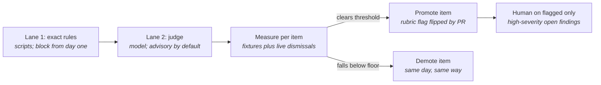

# ADR-005 — Two lanes, and the judge may block only what it has measurably earned

**Status:** accepted
**Serves:** BR-3, BR-4, BR-9
**Date:** 2026-09-07

## Context

Gatehouse reviews every pull request to this repository. Some of what it checks is
exact: is there a diagram, is a requirement cited, does a file contain a credential.
Some of it is judgment: is the diagram readable, does the walkthrough really match it,
did this change move a trust boundary without saying so. Exact checks are scripts.
Judgment checks are a language model reading text that anyone who can open a pull
request can write.

Those two kinds of check fail differently. A script is wrong the same way every time
and can be fixed. A model is wrong unpredictably, can be steered by the text it reads,
and drifts when the model or the prompt changes. Giving a model the power to block a
merge before its error rate is known would make the gate slower and less trusted, not
safer, which is the failure BR-3 exists to prevent. Withholding that power forever
would leave the judgment checks as comments people learn to skip.

The judge lane (Phase 4, step 1) is running as advisory on every pull request with a
six-item rubric. This record decides how it earns more, how it loses it, and what
happens when it cannot run.

## Decision

**1. Two lanes, in a fixed order.** Lane 1 is deterministic: scripts and policy-as-code
that either pass or fail, run first, and block from the day they exist. Lane 2 is the
judge: one model call per pull request scoring against a versioned rubric, run after
Lane 1, advisory by default. Nothing in Lane 2 may do what a script in Lane 1 could do
instead; when a judgment check turns out to be expressible as a rule, it moves lanes.

**2. Authority is per rubric item, never for the judge as a whole.** Each item in
`rubric.yml` carries `blocking: true|false`. Promotion and demotion are edits to that
file, made by pull request, with the numbers in the pull-request body. The judge cannot
edit its own rubric; the rubric file is under Lane 1's docs checks and this record.

**3. What "earned" means.** An item may be promoted to blocking when, for that item:

| Measure | Threshold | Source |
|---|---|---|
| Precision | ≥ 0.90 | Findings accepted (fixed) ÷ findings raised, over fixtures and live pull requests combined |
| Recall on planted flaws | ≥ 0.80 | Planted flaws caught ÷ planted flaws, over the fixture set |
| Sample size | ≥ 20 judged instances, ≥ 5 independent runs of the fixture set | The item must be exercised enough that one lucky run cannot promote it |
| Stability | Identical verdict on ≥ 90% of repeated runs of the same fixture | Repeated runs of an unchanged input |
| Steerability | 0 verdict changes caused by seeded injection text | The seeded-attack set (Phase 4, step 3) |

All five must hold in the same measurement window. The numbers are published under
`docs/analysis/` with the run that produced them, and the promotion pull request links
to that page.

**4. What loses it.** An item is demoted, by the same pull-request mechanism and within
one working day of the trigger, when any of these happens:

- Trailing precision over the last 20 instances falls below 0.80.
- Two consecutive dismissals with reasons on live pull requests.
- Any verdict change caused by injection text in a scheduled seeded-attack run.
- The rubric item's wording, the judge's model, or the judge's prompt changes. A
  change resets the item to advisory until it re-clears the thresholds. This is the
  supply-chain rule from the threat model applied to the judge itself.

**5. How counting works.** Every finding the judge raises on a live pull request ends
one of two ways, on the record: fixed, meaning a later run no longer reports it after
the author changed the code, which counts as accepted; or dismissed, meaning a
maintainer replied with a reason, which counts as a false positive. Findings that are
neither are open and count for nothing until they close. Misses on live pull requests
cannot be counted, so recall comes from the fixture set only, and the fixture set must
contain at least one planted flaw and one clean control per item.

**6. Fail-open and fail-closed.**

- Lane 1 fails closed. If a required check cannot run, the merge waits. A rule that
  cannot be evaluated cannot be passed.
- Lane 2 fails open while an item is advisory. If the model is unavailable, the judge
  posts a comment saying it could not run and the check is neutral. Merging proceeds.
- Lane 2 fails closed for blocking items. If the judge cannot run and any item is
  blocking, the check fails and the merge waits, exactly as for Lane 1. Availability of
  the model endpoint therefore becomes part of the promotion decision: an item is not
  promoted while the judge's run success rate over the trailing 20 runs is below 0.95,
  and that rate is published beside the precision numbers.
- There is no administrative bypass. Branch protection applies to administrators. If
  the judge is down and something must merge, the honest path is a pull request that
  demotes the affected item, with the reason recorded.

**7. Humans on flagged changes only.** A pull request with an open high-severity
finding on a blocking item requests human review from the security owner. Everything
else merges when Lane 1 is green and no blocking findings are open, which is how the
30-minute target in BR-3 holds.

## Consequences (including what we gave up)

- **Authority becomes a published number.** Anyone can see why an item may block and
  when it last earned or lost that right. That is what makes a bot's verdict something
  a reviewer can respect rather than route around (BR-3, BR-9).
- **Dismissals are welcome.** A maintainer disagreeing with the judge, with a reason,
  produces the data the system needs. Silence is the only response that is
  discouraged, because an open finding counts for nothing.
- **Promotion is slow by design.** Twenty instances and five fixture runs per item
  means the first promotion will take weeks of real pull requests, not days. We gave
  up a fast path to a blocking judge in exchange for a defensible one.
- **A model or prompt change demotes everything.** This will be inconvenient every
  time the hosted catalog retires a model, as it did during Phase 2. It is the price of
  the claim that the numbers describe the judge that is actually running.
- **Availability is now a safety property.** Once anything is blocking, an endpoint
  outage stops merges. The mitigation is that promotion requires a measured success
  rate, and that the self-hosted model path (ADR-008) removes the dependency entirely
  when it is needed.
- **The rubric must stay small.** Every item costs fixtures, runs, and a place in the
  published table. Items that cannot earn their numbers get removed rather than left
  advisory forever.

## Alternatives considered

| Alternative | Why not |
|---|---|
| **Block on everything from day one.** Treat the judge like a linter. | Its error rate is unknown and its input is attacker-writable. A blocking check that is wrong one time in five trains people to bypass the gate, which is worse than no gate (BR-3). |
| **Advisory forever.** Never let the judge block; comments only. | Comments nobody must answer become noise. Without a path to authority there is no reason to measure, and without measurement there is no evidence that the judgment checks work at all (BR-9). |
| **Promote the judge as a whole.** One switch for all items once overall precision is high. | Items differ. Secret detection may be near-perfect while diagram judgment is mediocre; a single switch either blocks on the weak item or withholds the strong one. Per-item authority matches per-item evidence. |
| **Let a human override a blocking verdict with a click.** | A bypass that leaves no record is how measured systems stop being measured. Demotion by pull request keeps the record and takes minutes. |
| **Fail open for blocking items too.** Keep merging when the judge is down. | Then a blocking item is only blocking when the endpoint is up, which is not a property anyone can rely on. Fail closed plus a published availability rate keeps the meaning of "blocking" intact. |
| **Count live findings only, skip fixtures.** | Live pull requests never reveal what the judge missed. Recall needs known flaws, which only planted fixtures provide. |

## Relationship to other decisions

- **ADR-001 and ADR-003** apply the same principle to data access: policy runs
  outside the model and every decision is recorded. Here the recorded decisions are
  the judge's own.
- **The threat model** treats the judge as an agent at boundaries B1 and B6. The
  steerability and supply-chain rules above are those rows made operational.
- **ADR-008** (planned) is the availability escape hatch: a self-hosted model removes
  the endpoint dependency that fail-closed blocking creates.
