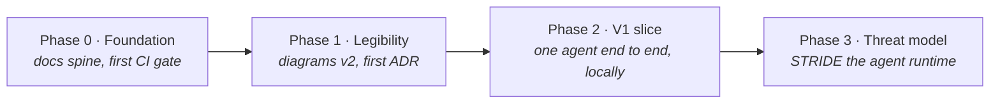
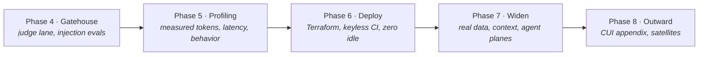

# Roadmap

> **In one line:** The build, in eight phases — first make the design readable, then make one thin path work, then attack it, measure it, deploy it, and widen it.

**You are here:** START HERE › Roadmap
**Audience:** 🟢 anyone · **Reads in:** ~6 min

## The 30-second version

This repo is built in phases, one pull request at a time. The order is deliberate: the
diagrams get fixed before any code, because everything later points at them. Then one
agent is made to work end to end on a laptop, so every later claim about safety or
quality is a claim about a running system. That running system is then threat-modeled,
attacked with deliberate injection attempts, and profiled with real numbers. Only after
it has earned trust locally does it get deployed to the cloud and widened into the full
platform. Each phase ends with something a reviewer can open: a diagram, a running demo,
a table of measured results, or a deployed service.

## The picture

Part 1 — build something real and name what could go wrong:

Part 2 — prove it, deploy it, widen it:

## How it works

Each phase below says what it does, why it comes where it does, and what "done" looks
like. Steps are pull-request sized; each PR cites the requirement it serves.

1. **Phase 0 — Foundation (done).** A repo that can be read cold and already gates
   itself: business case with BR-1…BR-7, v1 diagrams and narrative, the docs standard,
   the docs-standard CI check as Gatehouse's first deterministic rule, and the working
   contract in `CLAUDE.md`. Everything later hangs on this frame.
2. **Phase 1 — Legibility.** Fix the diagrams to meet our own rules, then write the
   first ADR. This comes first because the diagrams are what an interviewer sees first,
   and every later doc cites them.
3. **Phase 2 — V1 vertical slice.** One agent, one MCP server, the auth gateway,
   Guardrails, one golden eval, one trace — all running locally. This is the single most
   important phase: every later safety and evaluation claim needs a real system to be
   true about.
4. **Phase 3 — Threat model.** Take the running slice and ask how it gets attacked.
   Every threat maps to a mitigation and to a test ID, and the test IDs become the
   backlog for the next phase.
5. **Phase 4 — Gatehouse trust machinery.** Build the LLM judge lane, then the
   machinery that decides when it may block, then seed the eval sets with injection and
   tool-abuse attempts so containment becomes a measured number.
6. **Phase 5 — Workload profiling.** Instrument the agents and publish measured
   behavior: tokens, tool calls, latency distributions, long-horizon runs, with charts
   committed and at least one design decision the data drove.
7. **Phase 6 — Deploy.** Move the working slice to GCP with Terraform and keyless CI,
   without breaking the near-zero-idle cost constraint. Deferred until now on purpose:
   deploying an untested system proves nothing.
8. **Phase 7 — Widen Provenance.** Replace the slice's stubs with the real data,
   context, agent, and assurance planes, one PR each. The slice becomes the platform.
9. **Phase 8 — Outward.** Close the CUI story with the ADR-008 appendix, then extract
   reusable pieces into a patterns repo and upstream fixes as they arise.

## The details

### Phase 1 — Legibility (Serves: BR-4, BR-7) — diagrams done, ADR-001 open

1. Done: context, Provenance flow, and Gatehouse flow rebuilt as left-to-right parts
   with a numbered walkthrough and next-page link on each; narrative cross-references
   fixed.
2. Extend `scripts/check_docs_standard.py` to require "How it works" on template docs,
   so walkthrough-matches-diagram is enforced rather than hoped for.
3. PR ADR-001: the MCP auth gateway decision — context, options, decision,
   consequences — plus a short STRIDE sketch of the gateway that Phase 3 grows.

**Done when:** checker green, no v1 banners, ADR-001 accepted and linked from the ADR
index and the narrative.

### Phase 2 — V1 vertical slice (Serves: BR-3, BR-7) — done

1. Data stub: a small gold-view fixture in DuckDB with a handful of evidence rows, each
   carrying `system_id`. No Dagster or Iceberg yet.
2. `evidence-mcp`: an MCP server exposing two or three parameterized tools over the
   fixture. No model-written SQL (ADR-003, planned).
3. Auth gateway: a small service in front of the MCP server — verify identity, ask OPA
   for a decision, write an audit row, forward. Rego policy checked in.
4. Agent: the Evidence Collector as a NeMo Agent Toolkit workflow calling a hosted NIM
   endpoint; the key comes from `NVIDIA_API_KEY`, never the repo.
5. Guardrails: a NeMo Guardrails config wrapping the agent's input and output.
6. Eval: one golden question with an expected cited answer, as a script that exits
   non-zero on failure.
7. Observability: OpenTelemetry tracing to a local collector, one trace screenshot
   committed.
8. Sandbox seed: the agent runs in its own container whose only network egress is the
   gateway, the trace collector, and the model endpoint. Nothing else is reachable, so
   the gateway is the agent's whole world. This is the boundary the Pipeline Steward's
   command sandbox (Phase 7) builds on.
9. Docs: `docs/20-provenance/v1-slice.md` per the standard, with a
   run-it-in-five-minutes section.

**Done when:** one command runs the golden question through the gateway, the audit
table shows the call, the eval passes, and the trace exists. Met: `scripts/demo.py`
runs three cases (golden, direct injection, indirect injection) in the agent
container; results in `src/provenance/evals/results/latest.json`; see
`20-provenance/v1-slice.md`.

### Phase 3 — Agent-runtime threat model, T1 (Serves: BR-8, C5) — done

1. PR `docs/agent-threat-model`: `docs/02-architecture/agent-threat-model.md` per the
   template, with a seven-node trust-boundary diagram.
2. STRIDE table per boundary: user→agent, agent→gateway, gateway→MCP, agent→model,
   repo→agent (skills and prompts), and agent→host for any agent that runs commands.
   Threats include prompt injection, jailbreaks, tool-based exfiltration, unsafe tool
   invocation, model/skill supply chain, and sandbox escape.
   The agent→host boundary states the sandbox requirement for command-running agents
   (no host filesystem, no ambient credentials, egress allow-list) and names OpenShell
   as the NVIDIA-native runtime for it, with a plain locked container as the
   free-tier stand-in.
3. Three columns per threat: mitigating component (gateway, OPA, parameterized tools,
   Guardrails, audit), existing control or stated gap, planned test ID.
4. Update ADR-001's consequences and the narrative to point here.

**Done when:** every threat row has a mitigation and a test ID; gaps are stated, not
hidden. Met: `02-architecture/agent-threat-model.md`, seven boundaries, 33 rows,
9 passing, 20 planned with a phase, 4 named gaps.

### Phase 4 — Gatehouse G2, G3, G3+ (Serves: BR-3, BR-4, BR-8, BR-9)

1. PR G2 judge lane: a NAT workflow that scores a PR diff against a versioned rubric
   and posts an advisory comment. Never blocks yet.
2. PR ADR-005: two lanes; advisory→blocking promotion by measured precision;
   fail-open versus fail-closed rules.
3. PR G3 planted-flaw evals: synthetic PRs with known design flaws, a scoring script,
   and a published precision/recall table per rubric item.
4. PR G3+ seeded injection evals: adversarial cases added to the eval set — injection
   inside diffs and docs aimed at the judge, tool-abuse attempts against the Phase 2
   agent, a Garak probe run against both, and a NeMo Auditor safety evaluation of the
   agents' outputs. Results published side by side; Phase 3 test IDs closed.
5. Promote any rubric item whose measured precision clears the ADR-005 threshold to
   blocking.

**Done when:** the judge runs on every PR of this repo, the eval table is in the docs,
and at least one rubric item has earned blocking status with the numbers shown.

### Phase 5 — Workload profiling, W1 (Serves: BR-9, C4, P7)

Two workloads get profiled: the agents this repo builds, and the coding-agent harness
that builds this repo.

1. OpenTelemetry plus NAT profiling on the Phase 2 agent and the Phase 4 judge.
2. A repeatable profiling script that runs the golden and adversarial eval sets N times
   and writes raw results to a committed CSV.
3. `docs/analysis/agent-workload-profile.md` with committed charts: tokens per task,
   tool calls per task, p50/p95 latency, and a long-horizon run showing drift or
   stability.
4. Harness workload analysis, answering P7: instrument coding-agent sessions on this
   repo (the repo is built with one, so the raw material exists) and measure per turn: input and
   output tokens, context growth, tool-call mix, retries and re-reads, and where
   inference time goes across a session. Published as
   `docs/analysis/coding-agent-harness-profile.md` with committed charts and the
   collection method stated so it can be repeated on another harness.
5. A findings section in each doc stating what the numbers changed in the design
   (tool-count limits, prompt-size caps, context-management rules, or similar).

**Done when:** both profiles have charts in the repo and each names at least one
decision the data drove.

### Phase 6 — Cloud substrate and CI/CD, F2 and F3 (Serves: BR-5, C4)

1. PR F2 skeleton: Terraform modules mirroring the planes, `envs/dev.tfvars`, Workload
   Identity Federation bootstrap, no resources with idle cost.
2. PR F3: GitHub Actions — plan on PR, apply on `main` only. Requires the remote and
   branch protection to exist by now.
3. PR: Cloud Run services for the gateway and MCP server, scale-to-zero, secrets from
   Secret Manager.
4. Any cost above free tier is flagged before it is applied.

**Done when:** a PR shows a Terraform plan, `main` applies it, and the deployed gateway
answers the Phase 2 eval.

### Phase 7 — Widen Provenance, P1–P5 (Serves: BR-1, BR-2, BR-5, BR-7)

1. P1 data plane: Dagster assets, Iceberg bronze/silver/gold on GCS, Presidio redaction
   before silver, asset checks. ADR-002 and ADR-006 land here.
2. P2 context plane: `controls-mcp` with OSCAL catalogs; gateway hardened per Phase 3
   findings. ADR-003.
3. P3 agent plane: Control Mapper, Report Writer, and Risk Analyst as a separate A2A
   service. The Risk Analyst plus the exploitability verdicts form the platform's
   investigation-automation workflow: finding in, ranked and explained verdict out.
   ADR-004, and ADR-007 on human sign-off.
4. P4 assurance plane: NeMo Retriever with Milvus, scheduled Garak and NeMo Auditor
   runs, and an eval harness that re-scores every agent on every change.
5. P5 Pipeline Steward: the on-failure agent that diagnoses a broken Dagster job and
   opens a fix PR, itself gated by Gatehouse. It runs commands, so per C5 it runs
   inside a sandbox per the Phase 3 agent→host boundary: OpenShell where available, a locked
   container otherwise, with the escape tests from T1 in its eval set.

**Done when:** one real Security Onion alert becomes a cited line in a draft packet with
a human approval step in the loop.

### Phase 8 — Outward (Serves: C2)

1. PR ADR-008 appendix: confidential / air-gapped deployment pattern with self-hosted
   NIM, explicitly labeled design-only (no GPU confidential computing on the free tier).
2. Patterns repo: extract the gateway, the injection eval set, and the profiling harness
   as reusable pieces.
3. Upstream PRs to NVIDIA repos as they arise, logged in the README.

## Why it's built this way

The order is the argument. Phases 1 and 2 give a reader something to point at and
something to run. Phase 3 names what could go wrong. Phase 4 proves the defenses with
numbers and Phase 5 proves the cost and behavior with numbers, which is what makes
"contained" and "cheap" measured claims rather than assertions (BR-3, BR-7, C4).
Phase 6 shows the design deploys under the cost constraint, and Phase 7 shows it scales
to the whole platform (BR-1, BR-2, BR-5). Deploying or widening before the slice has
been attacked and measured would produce more surface area with no more evidence.
Writing the roadmap down at all is part of the same discipline as the ADRs: a plan you
can be held to is an architecture artifact, and drift from it should be visible in the
git history rather than silent.

## Go deeper

- `00-START-HERE.md` — the two-minute tour
- `01-business-case.md` — BR-1…BR-9 and C1…C4, which every phase cites
- `02-architecture/architecture-narrative.md` — what and why per stage, ADR map
- `40-adrs/README.md` — the planned decision records referenced above
- `../CLAUDE.md` — the working contract: rules, fixed stack, current queue
