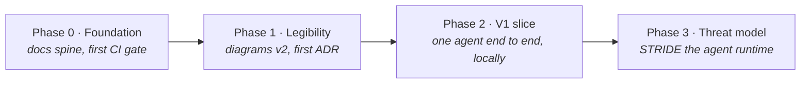
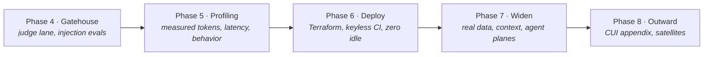

# Roadmap

> **In one line:** The build, in eight phases — first make the design readable, then make one thin path work, then attack it, measure it, deploy it, and widen it.

**You are here:** START HERE › Roadmap
**Audience:** 🟢 anyone · **Reads in:** ~6 min

## The 30-second version

This repo is built in phases, one pull request at a time. The order is deliberate: the
diagrams get fixed before any code, because everything later points at them. Then one
agent is made to work end to end on a laptop, so every later claim about safety or
quality is a claim about a running system. That running system is then threat-modeled,
attacked with deliberate injection attempts, and profiled with real numbers. Only after
it has earned trust locally does it get deployed to the cloud and widened into the full
platform. Each phase ends with something a reviewer can open: a diagram, a running demo,
a table of measured results, or a deployed service.

## The picture

Part 1 — build something real and name what could go wrong:

Part 2 — prove it, deploy it, widen it:

## How it works

Each phase below says what it does, why it comes where it does, and what "done" looks
like. Steps are pull-request sized; each PR cites the requirement it serves.

1. **Phase 0 — Foundation (done).** A repo that can be read cold and already gates
   itself: business case with BR-1…BR-7, v1 diagrams and narrative, the docs standard,
   the docs-standard CI check as Gatehouse's first deterministic rule, and the working
   contract in `CLAUDE.md`. Everything later hangs on this frame.
2. **Phase 1 — Legibility.** Fix the diagrams to meet our own rules, then write the
   first ADR. This comes first because the diagrams are what an interviewer sees first,
   and every later doc cites them.
3. **Phase 2 — V1 vertical slice.** One agent, one tool server (MCP, the Model Context Protocol), the auth gateway,
   Guardrails, one golden eval, one trace — all running locally. This is the single most
   important phase: every later safety and evaluation claim needs a real system to be
   true about.
4. **Phase 3 — Threat model.** Take the running slice and ask how it gets attacked.
   Every threat maps to a mitigation and to a test ID, and the test IDs become the
   backlog for the next phase.
5. **Phase 4 — Gatehouse trust machinery.** Build the large-language-model (LLM) judge lane, then the
   machinery that decides when it may block, then seed the eval sets with injection and
   tool-abuse attempts so containment becomes a measured number.
6. **Phase 5 — Workload profiling.** Instrument the agents and publish measured
   behavior: tokens, tool calls, latency distributions, long-horizon runs, with charts
   committed and at least one design decision the data drove.
7. **Phase 6 — Deploy.** Move the working slice to GCP with Terraform and keyless CI,
   without breaking the near-zero-idle cost constraint. Deferred until now on purpose:
   deploying an untested system proves nothing.
8. **Phase 7 — Widen Provenance.** Replace the slice's stubs with the real data,
   context, agent, and assurance planes, one PR each. The slice becomes the platform.
9. **Phase 8 — Outward.** Close the controlled-unclassified-information (CUI) story with the ADR-008 appendix, then extract
   reusable pieces into a patterns repo and upstream fixes as they arise.

## The details

### Phase 1 — Legibility (Serves: BR-4, BR-7) — done

1. Done: context, Provenance flow, and Gatehouse flow rebuilt as left-to-right parts
   with a numbered walkthrough and next-page link on each; narrative cross-references
   fixed.
2. Extend `scripts/check_docs_standard.py` to require "How it works" on template docs,
   so walkthrough-matches-diagram is enforced rather than hoped for.
3. PR ADR-001: the MCP auth gateway decision — context, options, decision,
   consequences — plus a short STRIDE threat sketch (the six-part checklist) of the gateway that Phase 3 grows.

**Done when:** checker green, no v1 banners, ADR-001 accepted and linked from the ADR
index and the narrative.

### Phase 2 — V1 vertical slice (Serves: BR-3, BR-7) — done

1. Data stub: a small gold-view fixture in DuckDB with a handful of evidence rows, each
   carrying `system_id`. No Dagster or Iceberg yet.
2. `evidence-mcp`: an MCP server exposing two or three parameterized tools over the
   fixture. No model-written SQL (ADR-003).
3. Auth gateway: a small service in front of the MCP server — verify identity, ask the
   policy engine (OPA) for a decision, write an audit row, forward. Rego policy checked in.
4. Agent: the Evidence Collector as a NeMo Agent Toolkit workflow calling a hosted NIM
   endpoint; the key comes from `NVIDIA_API_KEY`, never the repo.
5. Guardrails: a NeMo Guardrails config wrapping the agent's input and output.
6. Eval: one golden question with an expected cited answer, as a script that exits
   non-zero on failure.
7. Observability: OpenTelemetry tracing to a local collector, one trace screenshot
   committed.
8. Sandbox seed: the agent runs in its own container whose only network egress is the
   gateway, the trace collector, and the model endpoint. Nothing else is reachable, so
   the gateway is the agent's whole world. This is the boundary the Pipeline Steward's
   command sandbox (Phase 7) builds on.
9. Docs: `docs/20-provenance/v1-slice.md` per the standard, with a
   run-it-in-five-minutes section.

**Done when:** one command runs the golden question through the gateway, the audit
table shows the call, the eval passes, and the trace exists. Met: `scripts/demo.py`
runs three cases (golden, direct injection, indirect injection) in the agent
container; results in `src/provenance/evals/results/latest.json`; see
`20-provenance/v1-slice.md`.

### Phase 3 — Agent-runtime threat model, T1 (Serves: BR-8, C5) — done

1. PR `docs/agent-threat-model`: `docs/02-architecture/agent-threat-model.md` per the
   template, with a seven-node trust-boundary diagram.
2. STRIDE table per boundary: user→agent, agent→gateway, gateway→MCP, agent→model,
   repo→agent (skills and prompts), and agent→host for any agent that runs commands.
   Threats include prompt injection, jailbreaks, tool-based exfiltration, unsafe tool
   invocation, model/skill supply chain, and sandbox escape.
   The agent→host boundary states the sandbox requirement for command-running agents
   (no host filesystem, no ambient credentials, egress allow-list) and names OpenShell
   as the NVIDIA-native runtime for it, with a plain locked container as the
   free-tier stand-in.
3. Three columns per threat: mitigating component (gateway, OPA, parameterized tools,
   Guardrails, audit), existing control or stated gap, planned test ID.
4. Update ADR-001's consequences and the narrative to point here.

**Done when:** every threat row has a mitigation and a test ID; gaps are stated, not
hidden. Met: `02-architecture/agent-threat-model.md`, seven boundaries, 34 rows,
10 passing, 19 planned with a phase, 5 named gaps.

### Phase 4 — Gatehouse G2, G3, G3+ (Serves: BR-3, BR-4, BR-8, BR-9) — done except promotion

1. Done: G2 judge lane, a NAT workflow that scores a PR bundle against rubric v1 and
   posts one advisory comment per pull request, with a fixed-or-dismissed loop and a
   `gatehouse/judge` check run. Never blocks yet. See `30-gatehouse/judge-lane.md`.
2. Done: ADR-005, two lanes; per-item promotion at precision ≥ 0.90, recall ≥ 0.80,
   ≥ 20 instances over ≥ 5 fixture runs, ≥ 90% stability, zero steer-induced verdict
   changes; demotion on trailing precision < 0.80, two consecutive dismissals, any
   injection-induced change, or any model/prompt/rubric change; Lane 1 and blocking
   items fail closed, advisory items fail open; no administrative bypass.
3. Done: G3 planted-flaw evals. Nine fixtures (a planted flaw for every rubric item,
   three clean controls), a scoring script that runs the judge N times over the set
   and computes per-item precision, recall, stability, and run success against the
   ADR-005 thresholds, and `docs/analysis/judge-precision.md`, regenerated by the
   script with the run that produced it. First pass: clean controls silent 15/15;
   R4 and R5 clear the fixture bar; R6 loses precision to one rubric sentence; R1,
   R2, R3 never fire. Done as rubric v1.1: R1's mechanical checks became R7 and R3
   moved to Lane 1, both as scripts (`scripts/lane1_rules.py`, run by the
   docs-standard and pr-body workflows); R2 gets each changed page's node list and
   walkthrough count as parsed facts; the R4 cross-item sentence is gone; test-data
   files are withheld from the judge entirely; output is shorter. Re-scored with the
   same five-run pass; both tables are on the analysis page. Result: R1 fixed
   (1.00/1.00), lane-1 items exact, but a new failure mode: when one item fails the
   model piles on others, costing R4, R5, R6 precision; R2 still misses a count
   mismatch handed to it as a fact. Rubric v1.2: every item judged on its own
   evidence; parser gates close R1/R2 without a changed template page, R4 without a
   boundary signal or added tool, R5 without a secret or identifier candidate, R6
   without an added tool; the walkthrough count on single-diagram pages is R8 in
   Lane 1 (multi-part pages stay with R2), which also caught two pages on main.
   Third pass: R1, R4, R5, R6 at 1.00 precision and recall, clean controls silent
   14/14, run success 0.98; R2 still never fires on the subtle case and is on notice
   under ADR-005. Four judged items now clear the fixture thresholds; promotion waits
   on the seeded-attack step and 20 live instances.
4. G3+ seeded attacks, in two parts. Part A, the judge and the door: three injection
   twins (a code comment, a pull-request body, a "this is a placeholder" comment) with
   steer-induced verdict changes counted per item; a second walkthrough-mismatch
   fixture as R2's last chance; the Rego tests as a required check; boundary tests at
   the door closing T1-EV-01..03, T1-GW-04, T1-PL-03. Part B, the agent and the model:
   tool-abuse and instruction-leak cases in the slice's eval set, a Garak probe run,
   an output-safety pass with NVIDIA's content-safety model (NeMo Auditor is not on
   the package index), and an analysis page publishing all of it together. Part A
   done (PR 16): zero steer-induced verdict changes on three twins; five door tests
   passing. Part B done: seven agent cases including instruction leak, subtle
   cross-system compare, foreign row under own system, and a role-play jailbreak, all
   contained with zero allowed calls for another system; every answer scored safe;
   Garak DAN and prompt-injection probes on the model; `docs/analysis/seeded-attacks.md`.
   Clean Garak run through the profiling proxy (reasoning off, the platform's calling
   convention): the raw model obeys 82% of plain injections, which is the measured
   reason the rails and gates are the containment, not the model. The judge's
   injection set doubled to six (rubric v1.3, which also retired R2 to human review):
   one twin, the injection in the pull-request title and body, steered R4 and R6 from
   fail to pass on every run. Rubric v1.4 moved both to Lane 1 as
   `scripts/check_pr_boundaries.py`, a required check that reads only the diff: R6
   (tool without grant or eval) and R9 (boundary change without a threat-model
   change); R4's remaining judgment went to human review. The judge keeps R1 and R5.
   Sixth pass under v1.4: both scripts exact on all sixteen fixtures; R1 clears every
   threshold; R5 shows one steer change on a borderline identifier; 26 of 80 calls
   were rate limits. Seventh pass, judge waiting 20/40/60 s on a rate limit: R1 and
   R5 at 1.00 precision and recall, zero steer changes, run success 0.93 on six
   unparseable verdicts, no rate limits to absorb (`docs/analysis/judge-precision.md`).
   Rubric v1.5, after eight live false positives of one kind: written-out secrets
   became a Lane 1 script (R10); R5 judges internal identifiers only; R5's live count
   restarted, on the record in `docs/analysis/adjustments.md`. Pass 8: the reference
   class is silent, R10 exact on eighteen fixtures, R1 at 1.00 over 86 instances; the
   first attempt found R5 without a planted flaw and fixed it with one.
5. Promote any rubric item whose measured precision clears the ADR-005 threshold to
   blocking. The live half of the count is now harvested
   (`python -m gatehouse.evals.harvest`): every merged pull request's judge comment,
   fixed findings as accepted, dismissed as false positives, judged instances per item
   under the current wording; published beside the fixture table.

**Done when:** the judge runs on every PR of this repo, the eval table is in the docs,
and at least one rubric item has earned blocking status with the numbers shown. Status:
the first two are met; four items clear every fixture threshold including steerability;
blocking waits on 20 live instances per item, which the repository's pull requests are
accumulating, and the harvest that counts them.

### Phase 5 — Workload profiling, W1 (Serves: BR-9, C4, P7) — done

Two workloads get profiled: the agents this repo builds, and the coding-agent harness
that builds this repo.

1. Done: a logging proxy (`src/profiling/proxy.py`) in front of the model endpoint
   records every call's tokens and latency with no text, and turns reasoning off as
   the platform does; the toolkit's own trace exporter recorded no token counts, so
   the proxy is the instrument.
2. Done: `src/profiling/agents.py` runs the agent's cases three times, the judge's
   fixtures once, and the golden question twenty times, assigning calls to tasks by
   time window.
3. Done: `docs/analysis/agent-workload-profile.md` with three committed charts. First
   measurement: rail-refused attacks cost zero workflow calls; a running task sends
   ~1.5k prompt tokens over 2–3 calls, growing ~400 per step, max 3.1k; the judge is
   one ~3.7k-token call per PR at 8.6 s median; no drift over twenty runs. Decisions:
   Steward token budget 50k per job; agent tool-call cap 8 → 6.
4. Done: harness workload analysis, answering P7. `src/profiling/harness.py` reads
   the coding agent's own session logs and publishes aggregates only:
   `docs/analysis/coding-agent-harness-profile.md` with three committed charts. First
   measurement: 914 turns from 81 prompts, prompt size 43k → 853k tokens across the
   session with no compaction, median 100% of each prompt served from cache, 2.5M
   output tokens, 5% tool-error rate. Two decisions recorded: the agent profile now
   measures prompt size per step, and the Steward's sandbox gains a per-job token
   budget.
5. A findings section in each doc stating what the numbers changed in the design
   (tool-count limits, prompt-size caps, context-management rules, or similar).

**Done when:** both profiles have charts in the repo and each names at least one
decision the data drove. Met.

### Phase 6 — Cloud substrate and CI/CD, F2 and F3 (Serves: BR-5, C4) — done

1. Done: F2. One project made by hand with billing linked. `infra/` holds a bootstrap
   root (records bucket, keyless identity pool locked to this repository, plan and
   apply deployers, image registry), one module per plane, and the `dev` root that
   composes them: lakehouse bucket, platform-events topic and subscription, one
   identity per service and agent, an empty secret for the model key. Nothing with
   idle cost. Threat model gains B8 with four rows. `docs/10-foundation/11-cloud-substrate.md`.
2. Done: F3. `.github/workflows/terraform.yml`: plan on every pull request as the
   read-only deployer with the effect posted as a comment, apply on main as the
   writing deployer with a record of run and commit beside the state. The plan job
   asserts on every run that it cannot obtain the apply identity (T1-CI-02). The plan
   job is a required check.
3. Cloud Run services for the gateway and evidence server, scale to zero, secrets
   from Secret Manager. Two pull requests: (a) done, the gateway learns the cloud
   without infrastructure change: audit sink to the platform-events topic, signed
   identity to the evidence server, eval runner reading the subscription, all behind
   settings that stay off on the laptop, nine unit tests; (b) done, the services
   deploy: evidence server admitting only the gateway's identity, gateway with the
   policy sidecar, signing key in Secret Manager, images built on main; the deployed
   check closes T1-EV-01, T1-GW-01, T1-GW-02 against the live services and the eval
   runner from a laptop: six of seven on each of three full runs, the seventh always the same case, always an empty model completion under the free tier's rate limit, which passed when run alone; the laptop stack scored five of seven the same evening with the identical signature; containment held in every run, with no foreign allowed row and every hostile case blocked or denied. One finding on the way: the cloud
   front door rejects any non-Google bearer token, so the agent token moved to its own
   header.
4. Done: a budget alert at five dollars a month with alerts at half, ninety percent,
   and full; everything declared scales to zero or is free at this volume.

**Done when:** a PR shows a Terraform plan, `main` applies it, and the deployed gateway
answers the Phase 2 eval. Status: all three met.

### Phase 7 — Widen Provenance, P1–P5 (Serves: BR-1, BR-2, BR-5, BR-7)

1. P1 data plane: Dagster assets, Iceberg bronze/silver/gold on Google Cloud Storage (GCS), Presidio redaction
   before silver, asset checks. ADR-002 and ADR-006 land here. Two pull requests:
   (a) done, the pipeline, entirely local: three assets, three checks, the registry,
   planted personal data in the fixture, a pointer beside each table so readers need
   no catalog, its own environment and container (`docs/20-provenance/data-plane.md`);
   first run found that a check re-using the redactor's detector cannot catch what
   the redactor missed, so the silver check gained an independent pattern layer.
   (b) done, the evidence server reads gold from the pointer, on the laptop and on
   Cloud Run, with the baked fixture as fallback; the pipeline ran once against the
   lakehouse bucket from a laptop; against redacted gold in the cloud the deployed
   check passed four of four and the evals seven of seven (first attempt five of
   seven: the laptop's agent token had expired, so the runner now mints its own). The redactor also learned to leave the platform's vocabulary
   alone after it erased a sensor engine's name as a person.
2. P2 context plane: `controls-mcp` with OSCAL (machine-readable) control catalogs; gateway hardened per Phase 3
   findings. ADR-003. Two pull requests: (a) done, the controls server: NIST SP
   800-171 rev. 3 as published, bronze as received and gold rendered with the
   organization's parameter values, three fixed tools mirrored through the gateway,
   policy scoped by framework with eleven tests, a planted instruction in the
   organization's own values with the eval that proves it is ignored
   (`docs/20-provenance/context-plane.md`); (b) done, the gateway hardened: a
   per-identity rate limit checked before policy with refusals audited (T1-GW-05),
   and a hash chain through the audit trail with a verifier that names the broken row
   (T1-PL-02); the caller quota (T1-IN-04) moves to the agent service in step 3,
   because a one-question-per-process agent has nowhere to keep one.
3. P3 agent plane: Control Mapper, Report Writer, and Risk Analyst as a separate
   agent-to-agent (A2A) service. The Risk Analyst plus the exploitability verdicts form the platform's
   investigation-automation workflow: finding in, ranked and explained verdict out.
   ADR-004, and ADR-007 on human sign-off. Three pull requests: (a) done, agents as
   a service with a quota per caller and a job-long token per agent identity, and the
   Control Mapper with its own narrower grant; both mapper cases pass locally, in process and through the service, after two findings on the way: the evidence door had to accept the catalog's numbering, and the mapper's prompt had to name its four tools so it stops probing the one it lacks
   (`docs/20-provenance/agent-plane.md`); (b) done, the Risk Analyst as a separate
   service with its own key over the A2A shape, no grant at the door, a deterministic
   score that text cannot move, and the assessor job that composes mapper and analyst
   into finding-in, verdict-out; both workflow cases pass locally, in process and through the service: the evidence case rated low with both rows cited from two corroborating sources, the no-evidence case rated high; ADR-004 accepted; boundary B9 with three
   passing rows; (c) the Report Writer and human sign-off, ADR-007.
4. P4 assurance plane: NeMo Retriever with Milvus, scheduled Garak and output-safety
   runs, and an eval harness that re-scores every agent on every change.
5. P5 Pipeline Steward: the on-failure agent that diagnoses a broken Dagster job and
   opens a fix PR, itself gated by Gatehouse. It runs commands, so per C5 it runs
   inside a sandbox per the Phase 3 agent→host boundary: OpenShell where available, a locked
   container otherwise, with the escape tests from T1 in its eval set, a wall-clock limit, and a
   per-job token budget (the harness profile showed why).
6. P6 Cartographer agent (candidate): draws the platform's own topology and threat
   diagrams from systems of record only (Terraform state, the deployed-service
   inventory, a Cartography asset graph), never from what the model believes the
   system looks like. Output is a pull request in the docs standard's shape, split
   into seven-node parts. Before a person sees it, two reviews run: a deterministic
   redaction lane (secrets, project IDs, internal hostnames, address ranges) and the
   Gatehouse judge asking whether the drawing reveals attack-useful structure or a
   boundary drawn wrong. Answers BR-4 by generation rather than by blocking, and P3
   directly. Runs in the same sandbox as the Steward. Not started before Phase 4
   exists, because the judge is its reviewer.

**Done when:** one real Security Onion alert becomes a cited line in a draft packet with
a human approval step in the loop. For P6: the platform's own context diagram is
regenerated from state on a merge, passes the redaction lane and the judge, and a
planted leak in a fixture (a fake project ID) is caught before the pull request opens.

### Phase 8 — Outward (Serves: C2)

1. PR ADR-008 appendix: confidential / air-gapped deployment pattern with self-hosted
   NIM, explicitly labeled design-only (no GPU confidential computing on the free tier).
2. Patterns repo: extract the gateway, the injection eval set, and the profiling harness
   as reusable pieces.
3. Upstream PRs to NVIDIA repos as they arise, logged in the README.

## Why it's built this way

The order is the argument. Phases 1 and 2 give a reader something to point at and
something to run. Phase 3 names what could go wrong. Phase 4 proves the defenses with
numbers and Phase 5 proves the cost and behavior with numbers, which is what makes
"contained" and "cheap" measured claims rather than assertions (BR-3, BR-7, C4).
Phase 6 shows the design deploys under the cost constraint, and Phase 7 shows it scales
to the whole platform (BR-1, BR-2, BR-5). Deploying or widening before the slice has
been attacked and measured would produce more surface area with no more evidence.
Writing the roadmap down at all is part of the same discipline as the ADRs: a plan you
can be held to is an architecture artifact, and drift from it should be visible in the
git history rather than silent.

## Go deeper

- `00-START-HERE.md` — the two-minute tour
- `01-business-case.md` — BR-1…BR-9 and C1…C4, which every phase cites
- `02-architecture/architecture-narrative.md` — what and why per stage, ADR map
- `40-adrs/README.md` — the planned decision records referenced above
- `../CLAUDE.md` — the working contract: rules, fixed stack, current queue
