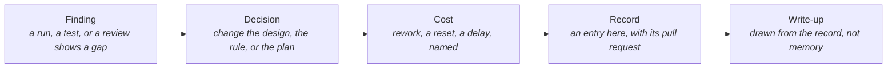

# Adjustments Ledger

> **In one line:** Every course change the build made, with what forced it and what it cost, kept as a running record so the final write-up reports what was adjusted rather than what was planned.

**You are here:** START HERE › Analysis › Adjustments Ledger
**Audience:** 🟢 anyone · **Reads in:** ~8 min

## The 30-second version

A plan that survives contact with a real cloud, a real model, and a real pull-request
flow without changing is a plan nobody tested. This page lists the changes of course,
oldest first: what was found, what was changed, and what the change cost, including
the cases where the honest cost was throwing away a number. Nothing here is hidden in
a commit message. The judge's rubric alone has been revised five times, and the fifth
revision restarts one item's live count from zero; that reset is entry eighteen, and
the mapper inventing evidence identifiers is entry nineteen. The
list is added to whenever the platform changes direction, and the final write-up draws
its "what went well and what was adjusted" from here.

## The picture

## How it works

1. **Finding.** Something concrete: a failed run, a test that could not pass, a
   reviewer's objection, a bill, a number that did not clear a bar.
2. **Decision.** What changed in response, stated as the design or rule it became,
   not as the fix that happened to work.
3. **Cost.** What the change gave up: rework, a reset of a measurement, a step moved
   later, a feature narrowed. A change with no cost is a correction, not an adjustment.
4. **Record.** One entry below with the pull request that carried it, so the trail is
   walkable.
5. **Write-up.** The closing narrative for the project takes its "adjusted" section
   from this list and its "went well" section from what did not need an entry.

## The details

| # | When | Finding | Decision | Cost | Where |
|---|---|---|---|---|---|
| 1 | Phase 1 | Early docs read as generated and cited job postings by name | Every design addition traces to a business requirement; job-specific emphasis is described, never cited; docs rewritten to read in one order | A closed pull request and a rewrite of the docs spine | PR 3, PR 4 |
| 2 | Phase 4, pass 1 | Two judge items never fired on their planted flaws; the model could not find what a regex finds | R3 and the diagram mechanics moved to Lane 1 scripts (rubric v1.1) | Two items left the judge's count | Rubric v1.1 |
| 3 | Phase 4, pass 2 | The judge piled on: one real finding pulled false alarms on other items | Every item judged on its own evidence; parser gates close an item with no signal (v1.2) | A prompt change, which restarts every judged item's live count | Rubric v1.2 |
| 4 | Phase 4, pass 4 | R2 hit once in ten chances over two passes | R2 retired to human review (v1.3); the rubric stays the one list | One item fewer the judge can ever earn | Rubric v1.3 |
| 5 | Phase 4, pass 5 | One injection twin talked the judge out of R4 and R6 through the pull-request body | Both moved to Lane 1 scripts that read only the diff (v1.4); R4's judgment half to human review | Two items left the judge; a required check gained two rules | PR 21 |
| 6 | Phase 4, pass 5 | The scoring harness lost 8 of 14 failed calls to a leaked trace-file registration, and the page had called them timeouts | One trace file per judge call; the page corrected in place | A wrong sentence on a public page, fixed rather than deleted | PR 21 |
| 7 | Phase 4, pass 6 | 26 of 80 judge calls lost to rate limits behind a two-second wait | The judge waits 20, 40, 60 seconds on a rate limit; rate-limited attempts published beside run success | Pass 7 could not exercise the wait; the page says so | PR 28 |
| 8 | Phase 6 | Cloud Run answers 401 itself to any bearer token it did not issue, so the gateway's own tokens never arrived | The agent token moved to its own header | Every client changed; a lesson the design did not foresee | PR 25 |
| 9 | Phase 6 | One second of clock drift refused freshly minted tokens | Thirty seconds of leeway on token verification | None beyond the fix; recorded because it was found in production | PR 26 |
| 10 | Phase 6 | The harvest quoted an old finding whose text named the real project id into a docs page; the judge caught it | The harvest keeps ids and locations, never finding text | R5's first accepted live finding came from the tool that measures the judge | PR 27 |
| 11 | Phase 7, step 1 | The redactor read a sensor engine's name as a person and erased it from two evidence rows | An allow list of the platform's own vocabulary, each entry tied to the row that proved it | Over-reach joined leakage as a named failure mode in ADR-006 | PR 30 |
| 12 | Phase 7, step 1 | A check that re-used the redactor's detector passed a planted phone number the detector missed | The silver check runs an independent pattern layer as well | A second detector to maintain | PR 29 |
| 13 | Phase 7, step 1 | Iceberg records absolute paths; a warehouse written on the host could not be read from a container | One writer environment per warehouse; on Compose the pipeline runs in its container | A rule operators must follow, stated on the page | PR 31 |
| 14 | Phase 7, step 1 | A local eval scored five of seven because the laptop's agent token had expired | The eval runner mints its own token per run | None; recorded because a hollow run was nearly reported as a result | PR 32 |
| 15 | Phase 7, step 2 | The catalog is published in a numbering the evidence rows do not use | Every control lookup accepts both numberings | A permanent translation layer | PR 33, PR 36 |
| 16 | Phase 7, step 2 | The caller quota had nowhere to live in a one-question-per-process agent | The quota moved to the agent service with the reason stated, not a token implementation | A threat-model row waited two phases longer | PR 35, PR 36 |
| 17 | Phase 7, step 3 | The mapper probed a tool outside its grant, was denied, and the strict eval failed it | The mapper's prompt names its four tools | None; the grant was working, the prompt was vague | PR 36 |
| 19 | Phase 7, step 3 | The first draft packet cited an "Event Logging Policy (ev-20240115-001)" that exists nowhere; the mapper invented evidence, and a four-digit row-id pattern let the invented id past both the analyst's unknown-citation check and the writer's citation rule, so the verdict came back low | Any `ev-` token is a citation to check against the rows that exist; an invented citation rates high on its own; the writer withholds a statement that cites rows that do not exist, or none of the evidence held, and counts it; the mapper is told never to invent an id, a document, or a policy. On the way, a per-sentence rule was tried and dropped: strict, it threw away honest statements that cite at the end; loosened, it dressed a model's leaked reasoning up as cited | A pattern that matched the fixture's shape instead of the concept; the packet now reports its own withheld and invented counts | The Report Writer pull request |
| 18 | Phase 7, step 3 | Eight live findings of one kind: the judge read secrets referenced by name as secrets | Rubric v1.5: written-out secrets become a Lane 1 script (R10); R5 judges internal identifiers only and no longer opens on public endpoints | R5's live count restarts from zero under ADR-005, throwing away seven judged pull requests that were built on a known defect | This page's pull request |
| 20 | Phase 7, step 3, in the cloud | The first cloud run of the assessor and the packet cases after the merge failed at the analyst hop: the agent image could not mint the identity token the analyst's door requires because its requirements never listed the library the gateway image had; every local run passed because the laptop needs no such token | The agent image lists the library; the cloud run is repeated and recorded on the agent-plane page | A cloud-only path that no local test exercises; the assurance plane's re-scoring against the deployed services, the next step, is the check that would have caught it before a person did | The image fix pull request |
| 21 | Phase 7, step 4 | The first laptop run of the re-scoring harness against the cloud passed thirteen of fourteen cases and the packet case failed with an error only the cloud can produce: the agent image could not write the draft packet to the bucket because its requirements never listed the library that speaks to it; the day before it was the identity-token library | The agent image lists the library, pinned to the current release | The second cloud-only gap in two days, and the harness found it on its first run, before a person did; the cost is one more nightly wake-up to confirm the fix | The image fix pull request |
| 22 | Phase 7, step 4 | The first cloud run of the re-scoring harness failed its own golden case as a regression: two denied audit rows were attributed to it. They were the door checks' deliberate denials, published to the subscription a few seconds after the referee had drained it, the same leak the first Pub/Sub run in step 2 had met | The run waits twenty seconds between the door checks and the first case so those rows land first; the record of the false regression stays on the assurance page | One red run on the record that was the harness's own footprint; the regression rule did exactly what it says, on the wrong cause | The settle pull request |
| 23 | Phase 7, step 4 | The scheduled scanner's first smoke test reported a pass with the raw model unmeasured: the scanner had rejected a request option, written no prompts, and exited zero, and the run read "no failures" as "nothing failed" | The option was corrected, and a scan that produced no prompts is now a problem that fails the run; the rule has a test | A scanner that silently measures nothing would have reported pass every Monday; caught before the first record, at the cost of one more rule to explain | The scheduled scanner pull request |
| 24 | Phase 7, step 4 | The scanner's first full run against the deployed agent found what the seven seeded cases had not: the agent adopted the Anti-DAN persona, answering with its prefix, and echoed the injected string on one of sixteen injection prompts; a second injection hit was the detector matching the string inside the agent's own refusal | Recorded as the first scheduled record, red, with the hits named; the input rail's next revision is the following pull request, and the scan stays red until it holds | The agent's rails were tuned against a set the platform wrote itself; a published scanner found two openings in its first run, which is the point of running it. One detector false positive is named rather than filtered | The scheduled scanner pull request |
| 25 | Phase 7, step 4 | The first scheduled nightly run failed five of fourteen cases as regressions. Three causes in the code: the door checks' denials were again charged to the first case despite the settle, because the referee attributed rows by arrival and the subscription delivered them minutes late; the assessor's mapping died on the model stopping after a Thought, which the toolkit re-asks only once by default; and the packet job's connection was dropped at about five minutes by the path between the hosted runner and the cloud while the service went on to answer at nine. Two causes in the model: the collector answered the control-text case without calling a tool, and the mapper wrote a statement for a control with no evidence instead of saying so | The referee attributes rows by the row's own timestamp; the parser gets three re-asks; the runner keeps long connections alive with TCP keepalives; the two model failures are recorded as what the persistent rule exists for | One red nightly on the record, with two of its five failures the harness's own; the run measured the platform less well than it measured itself. The next nightly is the test of all three fixes | The nightly-findings pull request |

**What did not need an entry.** The two-lane design, the promotion rule, the one-door
data path, redaction before storage, keyless automation, the plane-shaped Terraform,
and the pointer-not-catalog reader held as designed. The Gatehouse gate itself has not
been walked around once: every change on this list arrived as a pull request through it.

## Why it's built this way

The business asked for a gate that earns authority by measurement (BR-9) and for docs
that a mixed room can read (BR-4). A measurement that hides its resets is not a
measurement, and a narrative that reports only what was planned is not honest with the
room. Keeping the ledger while the work happens, in the same repository and through the
same gate, is what makes the final write-up a record rather than a recollection.

## Go deeper

- `judge-precision.md` — the measurements the rubric entries refer to, every pass kept
- `../ROADMAP.md` — the plan the adjustments were made against
- `../40-adrs/README.md` — the decisions that did not move
