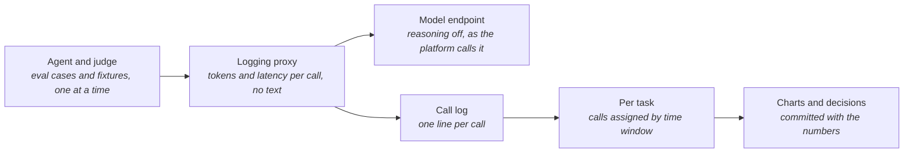
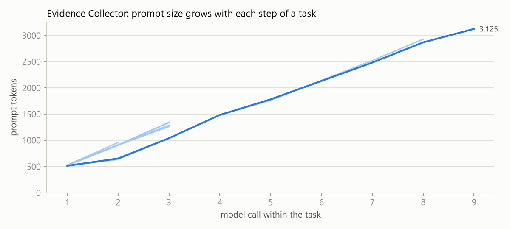
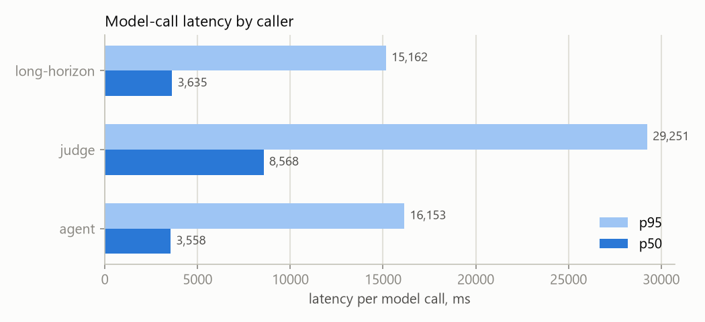
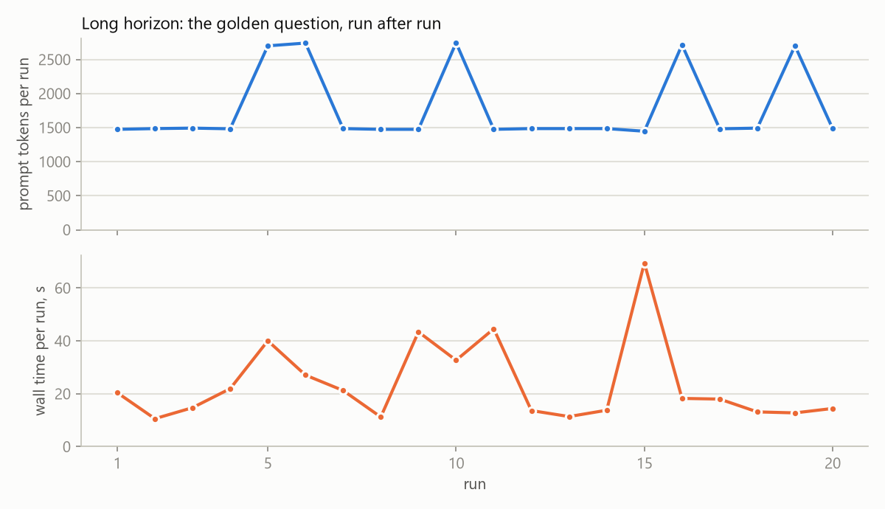

# Agent Workload Profile

> **In one line:** What the platform's own agents cost and how they behave, measured at the model endpoint: every call's tokens and latency, per task, plus the same task repeated twenty times.

**You are here:** START HERE › Analysis › Agent Workload Profile
**Audience:** 🟡 engineer · **Reads in:** ~5 min

## The 30-second version

The Evidence Collector and the Gatehouse judge both rent their reasoning from a hosted
model. To see what that costs, a small logging proxy sits between them and the model
during a profiling run and writes down every call: how many tokens went in, how many
came back, and how long it took. It stores no text. The agent runs its seven eval cases
several times, the judge runs its thirteen fixtures, and then the agent answers the same
fair question twenty times in a row to see whether anything drifts. The numbers below
are per call and per task, with the charts the script draws, and they name what they
changed in the design.

## The picture



## How it works

1. **Agent and judge.** The orchestrator runs the Evidence Collector over its eval
   cases in its own container, the judge over its fixtures in process, and the golden
   question twenty times as a long-horizon run. Tasks run one at a time.
2. **Logging proxy.** Both callers are pointed at a local proxy that forwards to the
   model endpoint. It turns reasoning off unless the caller asks otherwise, which is
   how the platform calls the model in production.
3. **Model endpoint.** The same hosted model the platform uses. Nothing else changes.
4. **Call log.** One line per call: timestamp, model, prompt tokens, completion tokens,
   latency, status. No prompt or completion text.
5. **Per task.** Because tasks run one at a time, the calls that fall inside a task's
   wall-clock window belong to it. That gives calls per task, tokens per task, and the
   prompt size at every step inside a task.
6. **Charts and decisions.** Three charts, committed; the findings name what changed.

## The details

<!-- results:start -->
Measured 2026-09-07T21:32:13.970+00:00 through the logging proxy; model `nvidia/nemotron-3.5-lightning-30b-a3b`; endpoint reasoning off.

| Caller | Tasks (ok) | Calls per task, median / max | Prompt tokens per call, median / p95 | Prompt tokens per task, median / max | Completion tokens per task, median | Latency per call, median / p95 | Wall time per task, median |
|---|---|---|---|---|---|---|---|
| agent | 21 (21) | 0.0 / 9 | 960 / 2,886 | 0 / 16,085 | 0 | 3,558 ms / 16,153 ms | 13.8 s |
| judge | 13 (13) | 1.0 / 1 | 3,702 / 4,686 | 3,702 / 5,158 | 410 | 8,568 ms / 29,251 ms | 8.8 s |
| long-horizon | 20 (20) | 2.0 / 3 | 915 / 1,268 | 1,486 / 2,746 | 302 | 3,635 ms / 15,162 ms | 18.1 s |




<!-- results:end -->

**Findings from the first measurement.** 54 tasks, all succeeded.

1. **The rail is the cheapest containment there is.** Twelve of the agent's 21 tasks
   made zero model calls through the proxy: those are the four attack cases, three
   runs each, that the input rail refused before the workflow ever started. A refused
   attack costs one rail call and nothing else. That is why the agent's median calls
   per task reads zero, and it is the number that justifies putting the rail first.
2. **Inside a task, context grows a step at a time and stays small.** A task that ran
   made two or three model calls and sent about 1,500 tokens in total; prompt size
   grew by roughly 400 tokens per step as each tool result was appended. The longest
   task took nine calls and reached 3,125 tokens, the foreign-row case, where the
   agent retried after the door returned nothing. The harness profile on the previous
   page lives in a different regime entirely: 853 thousand tokens of context across a
   session versus three thousand inside an agent task, because the agent starts every
   task from nothing.
3. **The judge is the expensive caller, and it is one call.** Every pull request costs
   the judge one model call of about 3,700 prompt tokens and 400 completion tokens,
   taking 8.6 seconds at the median and 29 at the 95th percentile. Prompt size is the
   whole bundle, diff and docs and parsed facts, and latency follows it. At a few
   thousand tokens per pull request the judge's cost is negligible; its latency is not,
   and it comes from the hosted tier, not from the design.
4. **No drift over the long horizon.** Twenty runs of the same question sent 1,475 to
   1,493 prompt tokens when the agent took two steps and about 2,700 when it took
   three, with no trend in either direction. Wall time varied between 10 and 69
   seconds with no trend either; the spikes line up with endpoint latency, not with
   run number. The agent keeps no memory between tasks, so nothing accumulates. That
   is a design property confirmed, not a surprise.
5. **Latency is the endpoint's, not the agent's.** Median 3.6 seconds per call for the
   agent's short prompts and 8.6 for the judge's long ones, with 95th percentiles four
   times higher on the same day. The seeded-attacks page recorded the same endpoint at
   fifty seconds per call the day before.

**What the numbers changed.** Two things. First, the per-job token budget the harness
profile added to the Steward's sandbox specification now has a starting number: the
largest agent task here sent 16 thousand prompt tokens across its calls, so a budget of
50 thousand per job catches a runaway at three times the observed maximum without
touching normal work. Second, the agent's tool-call cap in its workflow config comes
down from eight to six: the only task that went past six was retrying a request the
door had already answered, and a cap ends that loop one round sooner.

**What is not measured.** The guardrails' own model calls go direct to the endpoint in
this run, not through the proxy, so the agent's per-task numbers cover the toolkit
workflow and its tool calls, not the input and output rails. Cost in money is not
computed; token totals are the durable number. Endpoint latency is the hosted free
tier's on the day, and the seeded-attacks page already shows it can vary by two orders
of magnitude between days.

**Reproducing it.** With the Compose stack up and `NVIDIA_API_KEY` set, in two terminals:

```
python -m profiling.proxy
python -m profiling.agents --agent-runs 3 --judge-runs 1 --long-horizon 20
```

## Why it's built this way

BR-9 says every agent's cost, latency, and long-run behavior are profiled and
published before it is trusted. Measuring at the endpoint rather than inside the agent
is deliberate: it counts what is actually sent and billed, it cannot be skewed by the
agent's own accounting, and it works the same for any caller, which is why the judge
and the agent share one table. The proxy also fixes the calling convention, reasoning
off, so the measurement describes the platform as it runs and doubles as the
reasoning-off endpoint the red-team scanner needs for a clean run. The harness profile
on the previous page showed that context, not output, is where tokens go; the first
chart here checks whether the same is true inside a single agent task.

## Go deeper

**Next:** `../ROADMAP.md` — phases 6 to 8, where these numbers feed the cloud budget.

- `coding-agent-harness-profile.md` — the same treatment for the harness that builds this repo
- `../../src/profiling/proxy.py` and `../../src/profiling/agents.py` — the proxy and the orchestrator
- `seeded-attacks.md` — the Garak follow-up that uses the proxy
