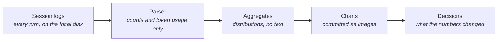
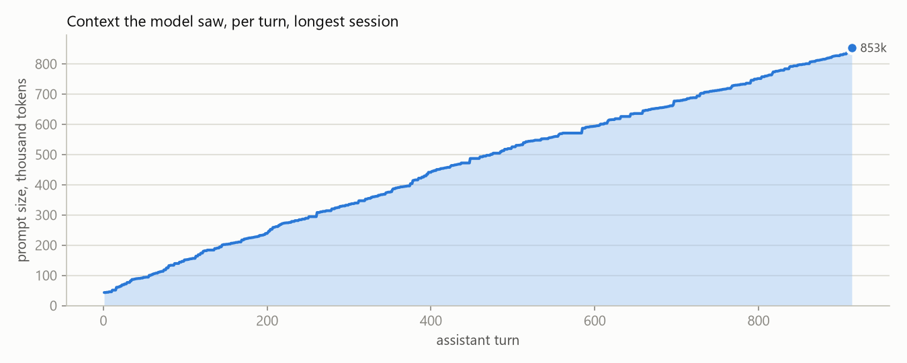
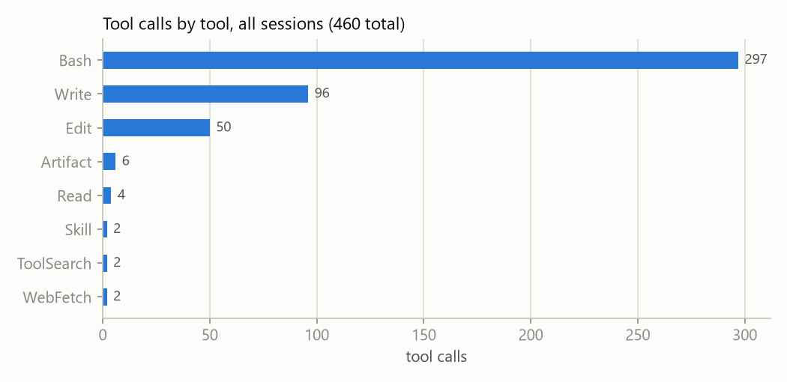
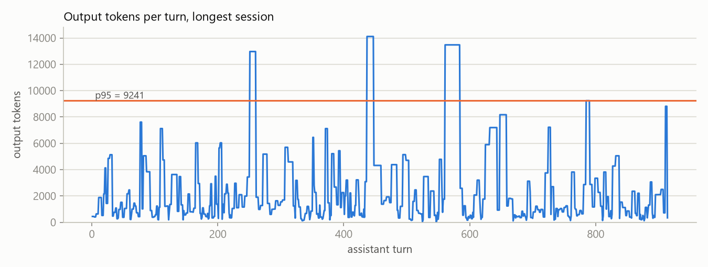

# Coding-Agent Harness Profile

> **In one line:** What the coding agent that built this repo actually consumed, measured from its own session logs: context size per turn, output per turn, tool mix, errors, and cache behavior.

**You are here:** START HERE › Analysis › Coding-Agent Harness Profile
**Audience:** 🟡 engineer · **Reads in:** ~5 min

## The 30-second version

The business case says the company already runs AI it has never measured: most
engineering teams use coding agents with no numbers on cost or behavior. This repo was
built with one, so the measurement starts at home. A script reads the agent's own
session logs and publishes only totals and distributions: how big each request to the
model was and how that grew across a session, how much of it was served from cache,
how many tokens came back, which tools were called and how often, how often a tool
call failed, and how often the same file was read again. No prompt, reply, command, or
file path is published. The method is written down so the same script can measure
another harness.

## The picture



## How it works

1. **Session logs.** The harness writes one file per session under the user's home
   directory, one record per event: each assistant turn with the model's token usage,
   each tool call, each tool result, each human prompt, with timestamps.
2. **Parser.** For every assistant turn it records the prompt size the model saw
   (fresh input plus cache read plus cache creation tokens), output tokens, the tool
   names called, and whether the turn carried visible reasoning. For every tool result
   it records success or error. File paths are hashed only to count repeat reads.
3. **Aggregates.** Medians, 95th percentiles, maxima, totals, shares, and the
   turn-by-turn series for the longest session. The results file beside the script
   holds these and nothing else.
4. **Charts.** Three images, regenerated by the script and committed: context per
   turn, tool mix, and output per turn.
5. **Decisions.** The findings below name what the numbers changed.

## The details

<!-- results:start -->
Measured 2026-09-07T21:01:10+00:00 over 1 session file(s): 914 assistant turns, 81 human prompts, 30.6 wall-clock hours.

| Measure | Value |
|---|---|
| Prompt size per turn, median / p95 / max | 487,100 / 808,203 / 853,205 tokens |
| Prompt size, first turn → last turn of the longest session | 43,420 → 853,205 tokens |
| Output tokens per turn, median / p95 / max | 1,406 / 9,241 / 14,113 |
| Output tokens, total | 2,489,737 |
| Share of each prompt served from cache, median | 100% |
| Tool calls | 460 across 9 tools; 460 of 914 turns call a tool |
| Tool errors | 23 of 459 results (5.0%) |
| Files read, and repeat reads of the same file | 4 files; 0 repeat reads |
| Turns with visible reasoning | 299 of 914 |
| Gap between records, median / p95 | 4.1 s / 23.2 s (a latency proxy) |

| Tool | Calls | Share |
|---|---|---|
| Bash | 297 | 65% |
| Write | 96 | 21% |
| Edit | 50 | 11% |
| Artifact | 6 | 1% |
| Read | 4 | 1% |
| Skill | 2 | 0% |
| ToolSearch | 2 | 0% |
| WebFetch | 2 | 0% |
| AskUserQuestion | 1 | 0% |




<!-- results:end -->

**Findings from the first measurement.**

1. **Context is the cost, and it only grows.** The prompt the model saw went from
   43 thousand tokens on the first turn to 853 thousand on the last, a straight climb
   with no compaction inside the session. Median prompt size was 487 thousand tokens.
   Output over the whole session was 2.5 million tokens; the prompt tokens presented
   to the model, summed over 914 turns, were two orders of magnitude more. Any budget
   conversation about coding agents that counts output tokens is counting the wrong
   thing.
2. **Caching is what makes that affordable.** The median turn had 100% of its prompt
   served from cache; the worst turn had 8%. The harness re-sends the whole history
   every turn and pays fresh-input rates only for what changed. Cost therefore depends
   on cache pricing and cache lifetime far more than on model choice, which is a
   procurement fact finance did not have.
3. **Eleven assistant turns per human prompt.** 81 prompts produced 914 turns, half of
   which called a tool. This is the ratio that turns "an engineer typed 81 things" into
   the token figures above, and it is the number to watch when a team adopts a harness:
   it moves with how much autonomy the harness is given.
4. **The tool mix is a policy artifact.** Two thirds of tool calls were shell commands,
   and only four were the dedicated file reader, because this session ran under an
   instruction to prefer the shell. That makes the "repeat reads of the same file"
   measure blind here: reads happened as shell commands, which this script does not
   parse. It is reported at zero and should be read as unmeasured, not as good behavior.
5. **One tool call in twenty failed.** 23 errors in 459 results, almost all
   self-inflicted scripting mistakes that were corrected on the next turn. The cost of
   an error is one more turn at the current context size, which by the end of this
   session meant nearly a million tokens per retry.
6. **Output is spiky.** Median 1,400 tokens per turn, 95th percentile 9,200, maximum
   14,000, with the spikes being whole files written in one turn.

**What the numbers changed.** Two things. First, the agent workload profile on the
next page now measures prompt size per step for the platform's own agents, not just
output and latency, because this session showed where the tokens actually go. Second,
the sandbox specification for agents that act (the Pipeline Steward, roadmap phase 7)
gains a per-job token budget alongside its wall-clock limit, because a runaway agent's
cost grows with its context, and this chart is what that looks like when nothing stops
it.

**Method, so it repeats.** Any harness that logs per-turn token usage and tool calls
can be measured the same way: map its records to prompt size, output tokens, tool
name, tool error, and timestamp, and the aggregation and charts are unchanged. The
script takes a directory argument; nothing in it is specific to this repo except the
default path.

**What is not measured.** Model latency is not in the logs, so the gap between
consecutive records is reported as a proxy and labeled as one. Cost in money is not
computed because rates differ by plan; token totals are the durable number. Quality of
the work is not in scope here; that is what the rest of the repo is for.

**Reproducing it.**

```
python -m profiling.harness
python -m profiling.harness --sessions <another harness's session directory>
```

## Why it's built this way

BR-9 says every agent the company runs is measured before it is trusted, bought or
built, and P7 names the coding agents engineering already uses as the unmeasured case.
Measuring the one that built this repo is the honest first sample: it is real work, not
a benchmark, and its logs already exist. Aggregates only, because the point is cost and
behavior, and because publishing the transcript of building a security platform would
be a leak of exactly the kind the platform exists to prevent. The method is the
deliverable as much as the numbers: finance asked for usage data before the next
renewal, and a script that turns any harness's logs into the same table is how that
request gets answered every quarter rather than once.

## Go deeper

**Next:** `agent-workload-profile.md` — the same treatment for the platform's own agents.

- `../01-business-case.md` — P7 and BR-9
- `../../src/profiling/harness.py` — the script
- `../ROADMAP.md` phase 5
