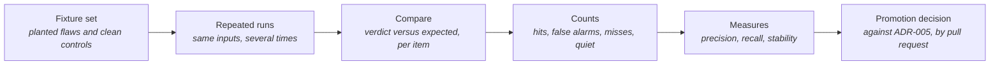

# Judge Precision

> **In one line:** How often the Gatehouse judge is right, per rubric item, measured against pull requests with known planted flaws and known clean changes.

**You are here:** START HERE › Analysis › Judge Precision
**Audience:** 🟡 engineer · **Reads in:** ~4 min

## The 30-second version

The judge reviews every pull request but may not block any of them until, item by
item, it has proven itself. Proof comes from a fixed set of synthetic pull requests:
some carry one deliberate flaw, some are clean. The judge is run over the whole set
several times. For each checklist item we count how often it flagged a real flaw, how
often it flagged a clean change, how often it missed, and how often it gave the same
answer twice. The table below is regenerated by the scoring script and states, for
each item, whether it meets the promotion bar today. Most will not for some time, and
the page says so rather than rounding up.

## The picture



## How it works

1. **Fixture set.** One directory per case under the judge's fixtures folder. Each has
   the pull-request body, the diff, the post-change docs where relevant, and an
   `expected.json` naming which items must fail, which may fail, and which must stay
   silent. Every rubric item has at least one planted flaw and at least one clean
   control.
2. **Repeated runs.** The scoring script runs the judge over every fixture N times.
   The same input every time; only the model's answer can vary.
3. **Compare.** For each run, fixture, and item: a required failure that was flagged is
   a hit; a required failure not flagged is a miss; a flag on an item the fixture says
   must stay silent is a false alarm; silence there is correct. Items the fixture marks
   as "may fail" are not counted either way.
4. **Counts.** Summed per item across all fixtures and runs.
5. **Measures.** Precision is hits over hits plus false alarms. Recall is hits over hits
   plus misses. Stability is the share of runs that agree with the most common verdict
   for each fixture. Run success is the share of judge calls that returned a parseable
   verdict at all.
6. **Promotion decision.** ADR-005 sets the bar: precision at or above 0.90, recall at
   or above 0.80, stability at or above 0.90, at least 20 instances over at least 5
   runs, run success at or above 0.95, and zero verdict changes under seeded injection.
   The table marks each item as meeting the bar or names what it lacks. Promotion
   itself is a separate pull request that flips the item's flag in the rubric.

## The details

<!-- results:start -->
Run 2026-09-07T17:13:59+00:00 · rubric v1.2 · model `nvidia/nemotron-3.5-lightning-30b-a3b` · 5 runs × 9 fixtures · judge run success 44/45 (0.98).

| Item | Lane | TP | FP | FN | TN | Precision | Recall | Stability | Instances | Fixture thresholds met |
|---|---|---|---|---|---|---|---|---|---|---|
| R1 Diagram reads as one story | 2 | 5 | 0 | 0 | 39 | 1.00 | 1.00 | 1.00 | 44 | yes |
| R2 Walkthrough matches the diagram | 2 | 0 | 0 | 5 | 34 | n/a | 0.00 | 1.00 | 39 | no: precision, recall |
| R4 Threat model updated when a trust boundary changes | 2 | 10 | 0 | 0 | 29 | 1.00 | 1.00 | 1.00 | 39 | yes |
| R5 No secrets or internal identifiers introduced | 2 | 5 | 0 | 0 | 34 | 1.00 | 1.00 | 0.98 | 39 | yes |
| R6 New agent tools ship with a policy grant and an eval case | 2 | 5 | 0 | 0 | 39 | 1.00 | 1.00 | 1.00 | 44 | yes |
| R3 Requirement cited | 1 | 1 | 0 | 0 | 8 | 1.00 | 1.00 | 1.00 | 9 | script; exact by construction |
| R7 Diagram mechanics | 1 | 1 | 0 | 0 | 8 | 1.00 | 1.00 | 1.00 | 9 | script; exact by construction |
| R8 Walkthrough count on single-diagram pages | 1 | 1 | 0 | 0 | 7 | 1.00 | 1.00 | 1.00 | 8 | script; exact by construction |
<!-- results:end -->

**Latest pass** is the table above; the script rewrites it on every run.

**Pass 2, rubric v1.1, kept for comparison.**

Run 2026-09-07T16:46:09+00:00 · rubric v1.1 · model `nvidia/nemotron-3.5-lightning-30b-a3b` · 5 runs × 9 fixtures · judge run success 43/45 (0.96).

| Item | Lane | TP | FP | FN | TN | Precision | Recall | Stability | Instances | Fixture thresholds met |
|---|---|---|---|---|---|---|---|---|---|---|
| R1 Diagram reads as one story | 2 | 5 | 0 | 0 | 38 | 1.00 | 1.00 | 1.00 | 43 | yes |
| R2 Walkthrough matches the diagram | 2 | 0 | 0 | 5 | 33 | n/a | 0.00 | 1.00 | 38 | no: precision, recall |
| R4 Threat model updated when a trust boundary changes | 2 | 8 | 5 | 0 | 25 | 0.62 | 1.00 | 0.96 | 38 | no: precision |
| R5 No secrets or internal identifiers introduced | 2 | 5 | 2 | 0 | 32 | 0.71 | 1.00 | 0.96 | 39 | no: precision |
| R6 New agent tools ship with a policy grant and an eval case | 2 | 4 | 1 | 0 | 38 | 0.80 | 1.00 | 0.98 | 43 | no: precision |
| R3 Requirement cited | 1 | 1 | 0 | 0 | 8 | 1.00 | 1.00 | 1.00 | 9 | script; exact by construction |
| R7 Diagram mechanics | 1 | 1 | 0 | 0 | 8 | 1.00 | 1.00 | 1.00 | 9 | script; exact by construction |

**Pass 1, rubric v1, kept for comparison.**

Run 2026-09-07T16:20:36+00:00 · rubric v1.1 · model `nvidia/nemotron-3.5-lightning-30b-a3b` · 0 runs × 9 fixtures · judge run success 0/0 (n/a).

| Item | Lane | TP | FP | FN | TN | Precision | Recall | Stability | Instances | Fixture thresholds met |
|---|---|---|---|---|---|---|---|---|---|---|
| R1 Diagram reads as one story | 2 | 0 | 0 | 0 | 0 | n/a | n/a | n/a | 0 | no: precision, recall, stability, instances, runs |
| R2 Walkthrough matches the diagram | 2 | 0 | 0 | 0 | 0 | n/a | n/a | n/a | 0 | no: precision, recall, stability, instances, runs |
| R4 Threat model updated when a trust boundary changes | 2 | 0 | 0 | 0 | 0 | n/a | n/a | n/a | 0 | no: precision, recall, stability, instances, runs |
| R5 No secrets or internal identifiers introduced | 2 | 0 | 0 | 0 | 0 | n/a | n/a | n/a | 0 | no: precision, recall, stability, instances, runs |
| R6 New agent tools ship with a policy grant and an eval case | 2 | 0 | 0 | 0 | 0 | n/a | n/a | n/a | 0 | no: precision, recall, stability, instances, runs |
| R3 Requirement cited | 1 | 1 | 0 | 0 | 8 | 1.00 | 1.00 | 1.00 | 9 | script; exact by construction |
| R7 Diagram mechanics | 1 | 1 | 0 | 0 | 8 | 1.00 | 1.00 | 1.00 | 9 | script; exact by construction |

**Reading the table.** Instances is the number of counted verdicts for the item, not
the number of fixtures: nine fixtures over five runs give up to 45 instances per item,
minus any "may fail" exclusions. A precision of n/a means the item never fired, which
is expected for a clean-heavy set on an item with one planted flaw; recall is the
number that matters first for those. Stability below 1.00 means the same fixture got
different verdicts on different runs, which is the variance the repeated runs exist
to expose.

**Findings from pass 1, rubric v1.** Read the table with the verdict log
beside it and five things stand out.

1. **Silence is reliable.** All three clean controls got zero findings on all five
   runs, 15 of 15. The judge does not invent problems on ordinary changes.
2. **The two items grounded in parsed facts are the two that clear the fixture bar.**
   R4 and R5 both reason from facts the parser hands them, tools added and
   secret-pattern hits, and both caught their planted flaw on essentially every run
   with no false alarms. That is the same lesson the judge lane learned on its first
   fixture: the model is reliable when it reasons over facts and unreliable when it
   has to find them in a long diff.
3. **R6's false alarms come from one sentence.** All three were on the network-path
   fixture, where no tool was added. The rubric's R4 text says "whenever R6 applies, R4
   applies"; the model applied it in reverse. One line of rubric wording cost the item
   0.38 of precision. It is removed in the next rubric version.
4. **R1, R2, and R3 never fired.** A nine-node top-to-bottom diagram, a walkthrough
   missing two boxes, and a pull-request body with no citation were each judged clean
   on every run, even though the parser had already reported the missing citation as a
   fact. Two of these are not judgment calls at all. Counting nodes, checking the
   direction keyword, and finding a "Serves: BR-n" line are exact rules, and ADR-005
   says an item that turns out to be expressible as a rule moves to Lane 1. R1's
   mechanical half and R3 go there next; the judge keeps only the readability part of
   R1. R2, whether the walkthrough matches the boxes, stays a judgment but will get the
   node list and the walkthrough count as parsed facts, the way R4 got its tool list.
5. **Two of 45 verdicts were unparseable.** Both on docs-heavy fixtures, both on the
   same run, consistent with the endpoint truncating a long answer. Run success of
   0.96 clears the 0.95 bar but only just; the fix is a tighter output format, not a
   longer timeout.

**Findings from pass 3, rubric v1.2.** Same nine fixtures, same five runs, same
model, 44 of 45 calls succeeded. The hypothesis from pass 2 was that judging items
independently and gating them on parser signals would return R4, R5, and R6 to pass-1
precision without losing R1's gain. It did.

1. **The pile-on is gone.** On the nine-node fixture the model now flags R1 and R2
   only, on every run. R4, R5, and R6 were gated closed by the parser, because a
   docs-only change carries no boundary signal, no secret or identifier candidate, and
   no added tool, and the model never had the chance to over-report them. R4 went from
   0.62 to 1.00, R5 from 0.71 to 1.00, R6 from 0.80 to 1.00, each with full recall.
2. **Four judged items now clear every fixture threshold.** R1, R4, R5, and R6 each
   show 1.00 precision, 1.00 recall, and stability at or near 1.00 over 39 to 44
   instances. The clean controls drew zero findings on all 14 successful runs.
3. **The gates did not hide anything.** Every planted flaw the gated items are meant to
   catch was still caught: the network path, the new tool, and the committed key were
   each flagged on every successful run. A gate closes only when the parser finds
   nothing of the item's kind in the change, so the cost of a wrong gate is a miss,
   and the fixture set exists to show one. None appeared.
4. **R2 remains the item the model does not do.** With the count moved to R8 in Lane 1,
   the script catches the four-entries-for-six-boxes page every time. The model, given
   the node list and the entry count as facts, still passed that page on all five runs;
   it flagged R2 only on the nine-node page, where the whole diagram is bad. What is
   left for R2 is whether the entries describe the boxes in order, and on the one
   fixture that tests exactly that, recall is zero. Under ADR-005 an item that cannot
   earn its numbers is removed rather than left advisory forever. R2 gets one more
   pass with the seeded-attack set and a second mismatch fixture; if it still never
   fires, it comes out of the judge and the docs standard keeps the human review.
5. **Run success 0.98**, one endpoint fault in 45.

Nothing is promoted on the strength of these tables. R1, R4, R5, and R6 meet the
fixture thresholds; ADR-005 also requires zero verdict changes under seeded injection,
which the next phase step measures, and 20 live instances, which the repository's
pull requests are still accumulating.

**Findings from pass 2, rubric v1.1.** Same nine fixtures, same five runs, same
model, 43 of 45 calls succeeded. Read against pass 1:

1. **What v1.1 targeted, it fixed.** R1, now a readability judgment only, caught its
   planted flaw on every run with no false alarms: 1.00 precision, 1.00 recall, from
   0.00 recall in pass 1. The two items moved to Lane 1, R3 and R7, are exact on all
   nine fixtures, one hit each and eight silences each, by construction.
2. **It exposed a failure mode pass 1 could not see.** On the one fixture that fails
   R1, the model also flagged R4 on four of five runs, R5 on two, and R6 on one, for
   a docs-only page with no boundary, no secret, and no tool. In pass 1 that fixture
   was judged clean on every item, so the pile-on never showed. Once the model finds
   one real problem it over-reports the rest. Those false alarms are what pulled R4
   from 1.00 to 0.62, R5 from 1.00 to 0.71, and R6 from 0.62 to 0.80 rather than
   higher. Away from that fixture the three items behaved: the network-path, new-tool,
   and secret fixtures were caught on every successful run, and the clean controls
   drew one stray R4 in fifteen.
3. **R2 still never fires on the count mismatch.** The parser now hands the model six
   boxes and four walkthrough entries as a fact, and it still passed the page on
   every run. It did flag R2 on the nine-node fixture every time, which is the
   may-fail case and is not counted. The count comparison is an arithmetic check, so
   it moves to Lane 1 next; the judge keeps only whether the entries describe the
   boxes in order.
4. **Run success held at 0.96**, two failed calls out of 45, both endpoint faults
   rather than unparseable output this time. The shorter output format did what it was
   meant to.

The next rubric version has two changes with a hypothesis each: judge every item
independently, so that one failure is not evidence for another, and move the
walkthrough count to the docs-standard script. The bet is that R4, R5, and R6 return
to pass-1 precision without losing R1's gain. If they do not, the pile-on is a
property of the model and the answer is one call per item.

Nothing is promoted on the strength of these tables. ADR-005 also requires zero
verdict changes under seeded injection, which the next phase step measures.

**What is not in these numbers.** Live pull-request findings are not yet counted;
ADR-005 says fixed findings count as accepted and reasoned dismissals as false
positives, and a harvest of those from the repository's pull requests joins this table
once there are enough to matter. Seeded-injection steerability is measured separately
in the next phase step. Both are named in the ADR as required for promotion.

**Reproducing it.**

```
pip install -e src/gatehouse
python -m gatehouse.evals.score --runs 5
```

The raw results, including a log of every run's verdict and any failed calls, are in
`src/gatehouse/gatehouse/evals/results/latest.json`.

## Why it's built this way

A rubric item's authority is a published number or it is nothing (BR-9, ADR-005).
Planted flaws are the only way to measure misses, because a live pull request never
reveals what a reviewer failed to see. Repeated runs are the only way to measure
stability, because a single run of a language model proves what it did once. Putting
the table on a page that is regenerated by the script, with the run that produced it,
keeps the claim and the evidence in the same place.

## Go deeper

**Next:** `../30-gatehouse/judge-lane.md` — the judge these numbers describe.

- `../40-adrs/ADR-005-two-lanes-promotion-by-precision.md` — the thresholds
- `../../src/gatehouse/gatehouse/judge/fixtures/` — the fixture set
- `../ROADMAP.md` phase 4 — the seeded-attack step that adds steerability
